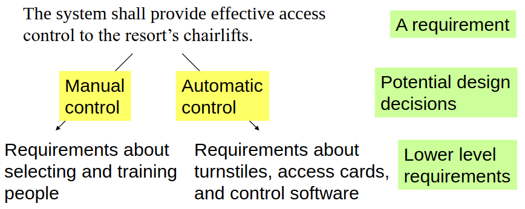

# Stakeholders
1. Definition
    - A person or organization who has an influence (direct or indirect) on a system's requirements.
          Indirect also includes situations where the stakeholder is impacted by the system.

1. Viewpoints
    - Stakeholders have individual views on the system, based on which parts are important to them
    - Different ones need to be taken into account
        
    - Views can conflict, so RE includes:
        * Discovering conflicts
        * Negotiating
        * Moderating
        * Finding a consensus

        * Determine where variability is needed

# Systems, machines and context
1. Explanation
    - Requirements rarely come in isolation
    - Requirements specify a system
    - A system can be a part of another system
    - A system is embedded in a domain or context

1. Requirements to which system? (Based on the sample problem)
    - The system shall count passing skiers per turnstile
        * System = turnstile control software
    - The system shall have effective access control to the chairlifts
        * System = everything: equipment, computers, cards, software
    - The system shall operate in the temperature range (-30 C, +30 C)
        * System = computer hardware and devices
    - The system shall offer 3 modes: normal, locked, unlocked
        * System = Access control software for a chairlift

1. System of systems (see image = Adora notation)
    - Requirements need to be framed in a context
    - Multi-level requirements are unavoidable

1. Context
    - General definition:
        * Network of thoughts and meanings needed to understand phenomena and utterances
    - Definition in RE:
        * The part of the system's environment, relevant for understanding the system and its requirements

    - Boundaries
        * System boundary: between system and its surrounding context
        * Context boundary: between system context and the rest of the application domain (the irrelevant part)

    - RE needs to determine the system boundary
        
    - Context models (see image) = understand and discuss context
        * Determine level of specification
        * System as a black box
        * Model actors which interact with the system
        * Model the interaction between system and actors
        * Model the interaction between actors
        * Graphical representation of result

1. Machines
    - Mapping World to Machine phenomena
        * World requirement: The system shall count the passing skiers per turnstile
        * Machine requirement: The turnstile software shall count the number of 'unlock for a single turn' commands

        * Machine one satisfies world one only if following assumptions:
            + Unlock command actually unlocks a turnstile
            + Only one person passes through an unlocked turnstile
            + Nobody passes through a locked turnstile (e.x. by crouching)

# Intertwining of Requirements and Design
1. Traditional = Waterfall
    - Make complete specification
    - Design and implement
    - Specification and Implementation are inevitably intertwined
        * Hierarchical intertwinement: high-level design decisions inform low-level requirements
        * Technical feasibility: non-feasible requirements are useless
        * Validation: what you see is what you require

1. Requirements vs Design Decisions
    - 
    - Depends on the level of decision making (a design decision turns into a requirement)
    - Requirement layers (railway system)
        * Business: More people shall be transported using the current tracks
        * System: The min. distance between two trains should always bee greater than the current breaking distance of the later train
        * Software: The current breaking distance should be recalculated every 100ms
    - Traditional belief
        * WHAT = Specification & HOW = Design
        * often doesn't work / not useful
    - Distinguish operationally
        * Requirement = statement owned by stakeholder (changes require approval)
        * Design = statement owned by supplier (changed freely)
        * But still intertwined => need validation
            + Requirement specifications are usually incomplete and unambiguous
            + Sometimes stakeholder know what they want once they've seen the options
            + It's good to get stakeholder feedback on some design decisions
1. Software architectures affect requirements
    - Frame: Set context and boundaries
        * Insights into the difficulty, risk and implementation costs
    - Constrain: Reveal what is feasible
        * Technical & Project (cost, risk, dev time) limitations
    - Inspire: Come up with added value

# Value Orientation
1. Why traditional doesn't make sense
    - Customers pay for systems, not requirements
    - Many successful project don't have complete specification
    - Good Requirements Engineering creates value
    - Value comes indirectly

1. Requirements are a means, not an end
    - They deliver value
        * Value = Benefit of reducing development risk (not meeting a stakeholder's desires and needs) - cost of specification
        * Low risk = little RE, high risk = fully-fledged RE
        * Assessment of value = assessment of risk

1. Assessing risk
    - Assess the criticality of requirement
    - Use requirement prioritization techniques
    - Consider other factors (risk = development risk without RE)
        * How distinctive is the product from existing stuff? (similar = low risk)
        * How good is the shared understanding among everyone involved? (good = low risk)
        * Are there any reference systems? (yes = low risk)
        * How long is the feedback cycle? (long = high risk)
        * What is the customer-supplier relationship? (competition = high risk, trust = low risk)
        * Is any certification required? (yes = high risk)

# Validation
1. Goal
    - Stakeholder's desires and needs -> Requirement specification -> Deployed system
    - Ultimate question: Does the deployed system reflect the stakeholder's desire?
        * Usually assessed late
    - Risk reduction question: Do the **documented** requirements match the stakeholder's desires and needs
    - Requirements quality question: Are the documented requirements of good quality (comprehensible, unambiguous)
    - Conflict question: Is there a consensus among the stakeholders?
    - If you make the effort to do engineer a requirement, you should validate it

# Evolution
1. Challenge: keep requirements stable, while allowing them to change
1. Solutions:
    - Short development cycles (1-6 weeks)
    - Explicit requirements management
1. Embrace opportunities for change (usually means you understand something better)

# Innovation
1. What?
    - Satisfying the stakeholders isn't enough
    - Need to strive for more, look for future opportunities
