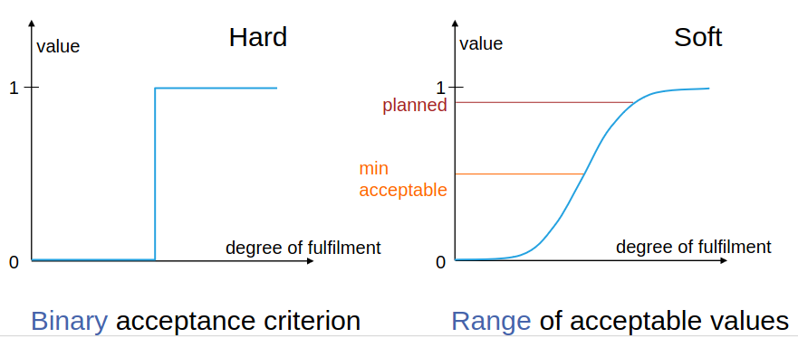
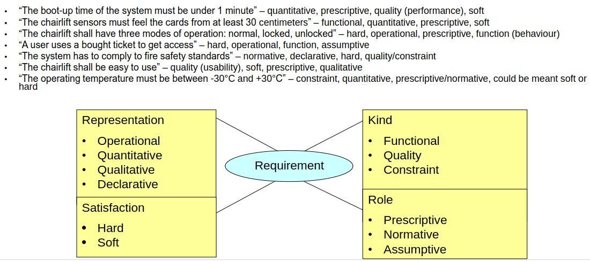

# Examples
1. A function: The turnstile shall count the number of "unlock" commands
1. A behavior: The operator shall be able to run the system in 3 modes
1. A project requirement: The system shall be deployed at most 5 months after signing the contract
1. A legal constraint: The system must comply with the privacy law of the country where it is deployed
1. A quality attribute (performance): The reaction time from X to Y must be shorter than 5 seconds
1. A quality attribute (availability): The system should have high availability

# Classification dimensions
1. Concerns
    - 
    - function = system's behavior, data, input, reaction, regardless of implementation
    - quality = a quality that the system should have
    - constraint = restriction on what, how, prescribed solutions
1. A faceted classification (Qualities that each requirement has)
    - Kind (see concerns)
    - Representation (Same requirement can be represented in different ways)
        * Operational
            + operation or data
            + process/action verb is used or statements about what NOT to do
            + Validation: Review, test, formal validation
            + Example: shall count the number of unlocks
        * Quantitative
            + measurable property
            + Validation: Measurement
            + Example: must be available for 99.99% of the time
        * Qualitative
            + goals
            + can't have hard satisfaction
            + Validation: Not directly. Prototype, subjective stakeholder judgement, goal refinement, derived metrics
            + Example: should be highly available
        * Declarative
            + required property
            + Validation: Review
            + Example: must comply with privacy laws
    - Satisfaction
        * 
        * Hard (Either satisfied or not)
        * Soft (Degree of satisfaction)
    - Role
        * Prescriptive
            + Classic What should a system do/have
            + Example: Sensor X shall be read every 100 ms
        * Normative
            + A norm in the environment, which is relevant for the system (laws)
            + Example: A social security number uniquely identifies a person
        * Assumptive
            + Not about the system, but about other systems, users, etc. More so assumptions
            + Required behavior of an actor who interacts with the system
            + Example: The operator shall accept every accept message
1. Interesting example
    - Requirement 1: any unauthorized access to data should be prevented
        * Concern: Quality, Security
    - Requirement 2: Database shall grant access only to users who have username and password
        * Concern: Also quality: security
    - Neither is functional
    - 1 is qualitative and 2 is operational
1. More examples
    - 
