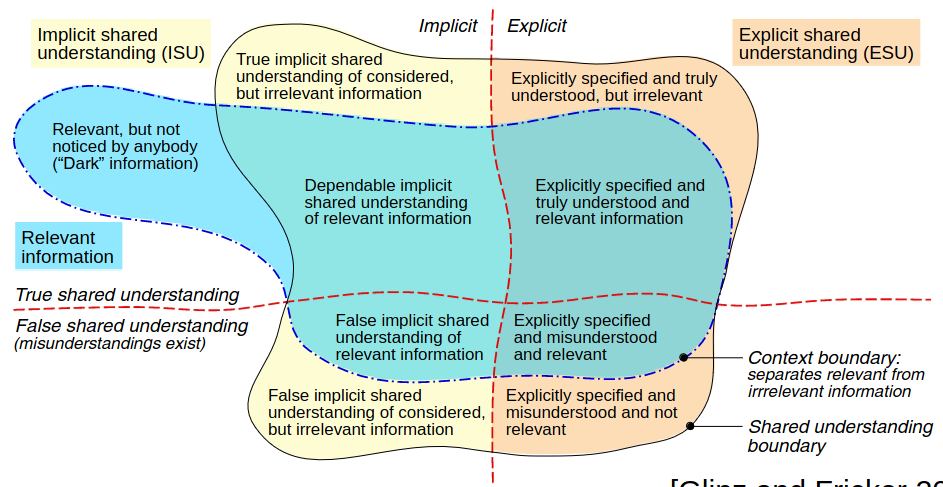

# Observations
1. Specifying everything explicitly is impossible and unfeasible
1. Explicit specifications can be misunderstood
1. RE deals with shared understanding
    - How do we establish it?
    - How can we rely on it?

# Types of shared understanding
1. 
1. Explicit / Implicit = does it need to be written down or said or not
1. True / False = Do all stakeholders have sufficiently similar idea
1. Relevant / Irrelevant = Is it relevant to the product
1. "Dark" = Nobody knows if some information is relevant or not
1. Examples: Traffic light
    - Implicit: red light = stop signal
    - Explicit: The stop signal shall be represented using a red light
    - False implicit misunderstanding:
        * Requirement: nothing
        * Stakeholders: go = green or yellow flashing
        * Developers: go = green
    - False explicit misunderstanding:
        * Requirement: there should be a yellow flashing light
        * Stakeholders: with red on the other side
        * Developers: with yellow flashing on the other side
    - Explicit shared, irrelevant:
        * The color of the box which holds the control computer
        * Specifying dark green yields irrelevant information
    - Dark information:
        * Legal constraint that no flashing yellow with red on other side
        * Nobody is aware of it
1. Paraphrasing: Do good software development by
    - P1: Achieving shared understanding by explicit specifications as far as needed
    - P2: Relying on implicit shared understanding of relevant information as far as possible
    - P3: Determining the optimal amount of explicit specifications
        * i.e. striking a proper balance between the cost and benefit
    -  Value = Benefit - Cost
        * Benefit of explicit specification = lower probability that the system won't satisfy the stakeholder's expectations & needs
        * Cost of writing, reading and maintaining the specification
1. Enablers of shared understanding
    - Domain knowledge exists
    - Previous joint work or colab
    - Reference systems exist
    - Shared culture and values (e.g. what is a clean UI, Japanese web pages)
    - Mutual trust (e.g. company builds bridge not connected to the street, because not specified)
    - Contractual situation
    - Normal design (e.g. same as other systems in the same environment)
1. Obstacles to shared understanding
    - Contractual situation
    - Radical design (e.g. i.o.t, digital twin, different understandings)
    - Geographical distance (reduces communication)
    - Outsourcing (people don't know each other => don't communicate)
    - Regulatory constraints (no longer need to rely on shared understanding)
    - Large or diverse teams (can work, but communication needed, else differences)
    - Fluctuation of personnel (e.g. experienced people leave, new people need to build shared understanding)

# Achieving and Relying on Shared Understanding
1. Building
    - Requirements elicitation (chapter 7)
1. Assessing
    - Validate all explicitly defined requirements
    - Test implicit shared understanding
1. Reducing the impact of false shared understanding
    - Short feedback cycles
    - Build and assess early
    - Specify and validate high-risk requirements explicitly

