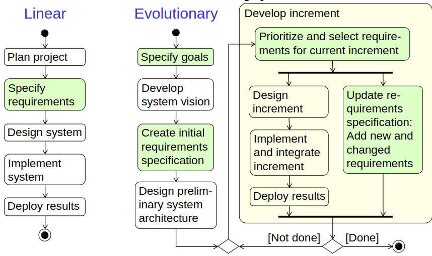

# Principal tasks
1. Requirements Elicitation (DE: Gewinnung)
    - Seeking, capturing and consolidating requirements from available sources
1. Requirements Documentation
    - Persisting the elicited requirements
    - Creating the Software Requirements Specification (SRS)
1. Requirements Agreement (DE: Übereinstimmung)
    - Resolving conflict
    - Finding requirements that are acceptable to stakeholders
1. Cross-cutting actions
    - Requirements Validation
    - Requirements Management (DE: Verwalten)

# Dimensions of processes
1. Linear vs Evolutionary
    - 
    - When Linear?
        * Clear, stable, a priori known requirements
        * Low risk (of developing the wrong system)
        * Short project duration
        * Change process for complex requirements is acceptable
    - When Evolutionary?
        * Evolving requirements
        * High risk (...)
        * Long project duration
        * Need to be able to easily change requirements
1. Prescriptive vs Explorative vs COTS-driven
    - Prescriptive
        * Specification is a contract: everything is binding and needs to be implemented 
        * Functionality defines cost and deadlines
        * Needed when tendering design and implementation
        * Development may be outsourced
        * Frequently combined with linear
    - Explorative
        * Only know goals, requirements are explored
        * Stakeholders are strongly involved, need continuous feedback
        * Prioritizing and negotiating requirements
        * Deadlines and cost constrain functionality
        * Typically only with evolutionary
    - Commercial Off The Shelf (COTS)
        * Not developed, but bought as a standard from a supplier
        * System mostly from COTS software
        * Requirements must reflect the functionality of the COTS solution
        * Requirements prioritized by importance
        * Often only specify requirements which are not covered by the COTS
1. Customer-specific vs Market-oriented
    - Customer-specific
        * Bespoke = System is ordered by a specific customer and is developer for them
        * Individual persons identified for stakeholder roles
            + Stakeholders on customer side are the main source of requirements
    - Market-oriented
        * System is developed as a product for a market
        * Prospective users typically not identifiable
        * Requirements are specified by the supplier
        * Marketing and system architects are the main stakeholders
        * Requirements come from the supplier guessing/estimating/eliciting the needs of the assumed users
1. Typical combinations
    - **Participatory** (evolutionary, exploratory, customer-specific)
        * Supplier and customer closely collaborate
        * Customer stakeholders strongly involved in the specification and development process
        * Trust and collaboration between the parties
    - **Contractual** (linear, prescriptive, customer-specific)
        * Specification = contract for developing the system
        * Developers not involved in the specification
        * Little stakeholder interaction after requirements specification
    - **Product-oriented** (evolutionary, mostly exploratory, market-oriented)
        * An organization specifies and develops software
        * It is sold/distributed as a product
    - **COTS-aware** (linear or evolutionary, COTS-driven, customer-specific)
        * Requirement specification part of project which consists of COTS
1. Agile requirements processes
    - Pushes evolutionary and exploratory to the extreme
    - Fixed-length iterations
    - PO or customer rep always there for feedback and decisions
    - Only goals and vision upfront
    - Loose requirements: stories
    - Details found in test cases
    - At the beginning of an iteration:
        * Customer prioritizes requirements
        * Developers select requirements to be implemented
    - Short feedback cycle
    - Continuous experimentation:
        * Deployment = experiment and test to see what customers needs
1. Characteristics of an ideal RE process
    - Strongly interactive
    - Close and intense collaboration between
        * Stakeholders (know the domain problem)
        * Requirements engineers (know how to specify)
    - Very short feedback cycles
    - (Technical and Deadline) risk- and feasibility aware 
    - Careful negotiation / conflict resolution
    - Focus on building shared understanding
    - Strive for innovation

