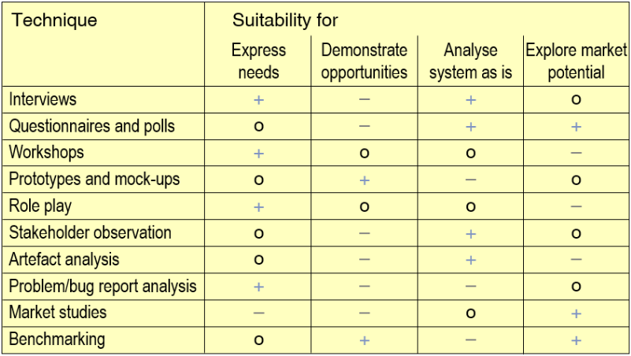
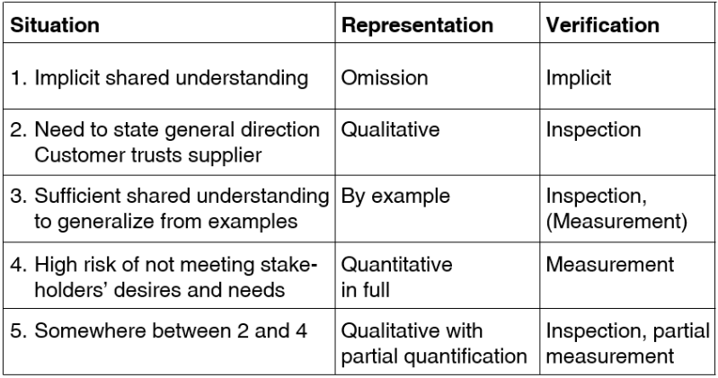

# Elicitation of requirements
1. Techniques

    - Ask
        * Interview stakeholders (what do they want, what is wrong with their old system)
        * Use questionnaires and polls (scales better)
    - Collaborate
        * Hold workshops (stakeholders interact with each other)
    - Build and play
        * Build, explore and discuss prototypes or mock-ups
            + Use as a base to ask them what they want differently
        * Perform role-playing (if a role is not available)
    - Observe
        * stakeholders in their work context
        * silently or also ask questions
    - Analyze
        * work artefacts (e.g. travel form, is it all needed?)
        * problem/bug reports (existing bugs)
        * market studies (what's on the market? where do we position?)
        * benchmarking (look at current values of key aspects)

1. Typical problems
    - Inconsistencies among stakeholders
        * In needs and expectations => conflicts
            + Can sometimes be solved by talking (stakeholders understand each other's needs)
            + Might end up needing negotiation
        * In terminology
    - Stakeholders sometimes
        * know, but cannot express their needs
            + can't explain the problem in terms of a structured process
        * don't know their needs
            + requires more work: more prototypes to see which solution excites them the most
        * have a hidden agenda
            + can't be sure, that everyone wants the best for the product
            + might have very specific requirements which don't make sense
        * think in solutions and not in problems
            + they explain what solution they want instead of what problem they are trying to solve
            + have to explicitly ask about the underlying problem
        * neglect quality requirements and constraints
            + should explicitly ask for it

1. Who should elicit requirements?
    - Stakeholders must be involved
    - People with domain knowledge
        * Stakeholders
        * Requirements engineer
        * A "smart ignoramus"
            + asks stupid questions which clear up false implicit understandings
            + questions whether old practices are still relevant
    - Stakeholders shouldn't specify stuff without someone who knows about requirements engineering
    - Best results are achieved when they collaborate

1. Eliciting types of requirements
    - Functional Requirements
        * Who wants to achieved what with the system?
        * For every identified function
            + What's the desired result and who needs it?
            + Which transformations and inputs are needed?
            + In which states is it available?
            + Is it dependent on other functions?
        * For every identified behavior
            + In which states should the system have it?
            + Which events lead to it?
            + Which events terminate the behavior?
            + Which functions are involved?
        * For every identified data item
            + What are the required structure and properties?
            + Is it static or is it flow?
            + If static - must it be persisted?
        * Analyze mappings
            + How do real world functions/behaviors/data map to the ones in the system?
        * Specify normal and special cases
    - Quality Requirements
        * Usually specified in qualitative form
            + "The system shall be fast"
            + "We need a secure system"
        * Problems
            + Ambiguous
            + Difficult to achieve and verify
        * Classic approaches
            + Quantification (come up with sth to measure) -> measurable, but may be expensive
            + Operationalization (come up with function/device which realizes this) -> testable, but implies premature design decisions
        * New approaches
            + Should be represented so that they deliver optimal value
            + Requirement's value = benefit of development risk reduction - cost for specification and verification
            + Assesses the criticality of a quality requirement
            + Represents it accordingly
            + Broad range on representations
            + 
    - Performance Requirements
        * Things to elicit
            + Response time for performing a task or producing a reaction
            + Data volume
            + Throughput
            + Frequency of usage of a function
            + Accuracy of computation
        * What is the meaning of a given value?
            + Minimum? Maximum? Average?
            + Within a given interval?
            + According to a probability distribution?
        * How much deviation can be tolerated?
    - Other Quality Requirements
        * Ask explicitly
        * Can use a quality models (reliability, portability)
            + as a checklist
            + to quantify certain quality requirements
    - Constraints
        * Ask about restrictions (of the solution space)
            + Technical: e.g. interfaces to other systems
            + Legal: e.g. laws, standards, regulations
            + Organizational: e.g. structures and processes which must not be changed by the system
            + Cultural, Environmental
        * Check if requirement is concealed by a constraint
            + Example constraint: When in exploration mode, the print button should be grayed out
            + Actual requirement: When the system is used without a valid license, the system shall disable printing

1. Documenting elicited requirements
    - Build the specification incrementally and continuously
    - Document the requirements in small units
    - End over means: Result -> Function -> Input
    - Consider the unexpected: specify special cases
    - Quantify critical quality attributes
    - Explicitly document critical assumptions
    - Avoid redundancy
    - Build a glossary of terms and stick to it
