# Modeling basics
1. Idea
    - Mostly for technical specification (precise and give an overview)
1. Characteristics and options
    - Requirements are usually formulated in a problem-oriented approach (what problems should be solved)
    - Architecture and Design info is usually omitted
    - Usually graphically represented
    - Semi-formal or formal representation (e.g. UML)
1. What can be modeled?
    - System view
        * Static structure perspective
            + (Entity-Relationship) data models
            + Class and object models
            + Component models
        * Behavior perspective
            + overall behavior (what states?, what stimuli received when?)
            + Finite state machine
            + State charts
            + Petri nets
        * Function and flow perspective
            + model a function and do some computations based on input
            + flow = model a specific process (place order -> check availability -> order -> ship -> ...)
            + Activity models
            + Data / Information flow models
    - User-system interaction view
        * Model interaction between a system and its external actors
        * User cases, scenarios
        * Sequence diagrams
        * Context models
    - Goal view
        * model goals and their dependencies
        * Goal trees
        * Goal-agent networks (e.g. i\*)

# Models of static system structure
1. Data Modeling: Entity-Relationship models
    - Models the **relevant part of the domain** using entity- & relationship types and attributes
    - 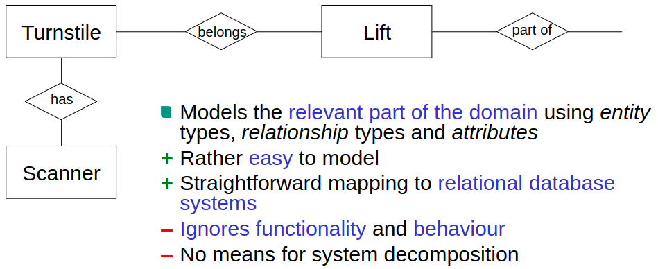
    - Pros
        * Easy to model (and explain to stakeholders)
        * Straightforward mapping to relational DB systems
    - Cons
        * Ignores functionality and behavior
        * No system decomposition (can't split up easily if too big)
1. Object and Class modeling
    - Identify entities in the domain which need to be stored and processed
    - Map those to objects/classes, attributes, relationships, operations
    - Represent all of this in a static structural model (connected classes)
    - Modeling individual objects is too specific (or unknown at the time of specification)
        * Classify objects of the same class (Class model)
        * Select an abstract representative (Object model)
    - Terminology
        * Object
            + individual entity with an identity (does not depend on others: no attributes)
            + Examples: Turnstile no 002, The Plauma chairlift
        * Class
            + Set of objects of the same kind (based on structure), their behavior and how to manipulate them
            + Examples: Turnstile, Lift
        * Abstract Object
            + Representation of individual object or a set of them with the same time
            + Example: A Turnstile
    - Class models / diagrams
        * 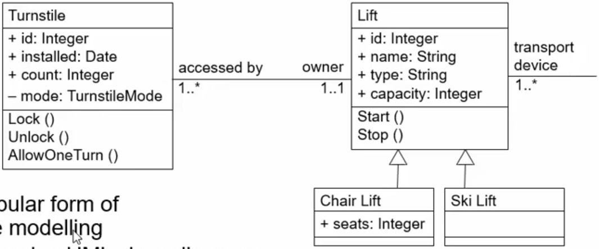
        * Most popular form of structure modeling
        * Typically using UML
        * Sometimes not enough (=> need Object Models)
            + when we need to distinguish between 2 objects of the same class
            + can't be decomposed properly (2 objects of the same class, but in different subsystems)
            + Subclassing is a workaround, but not a proper solution
    - Object models
        * Useful when there is a lot of distinction between objects
        * Example: Incidents: incoming, current, dispatched, closed
        * Solution using Class models
            + Incident class with subclasses
            + Bad: All classes are structurally identical => code smell
            + Bad: As the status of an incident changes, objects need to be destroyed and recreated with a new class
        * Composite Structure Diagrams
            + Specify the structures of interconnected elements
            + 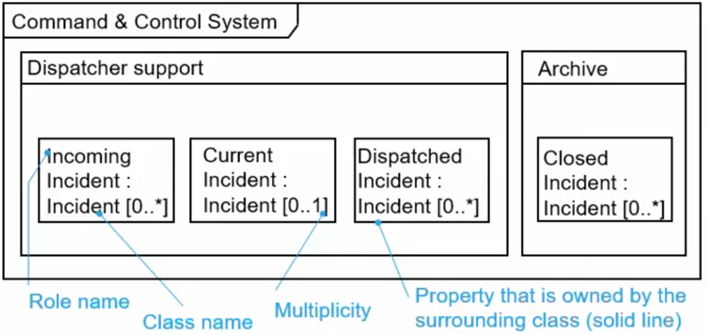
        * Example using UML
            + 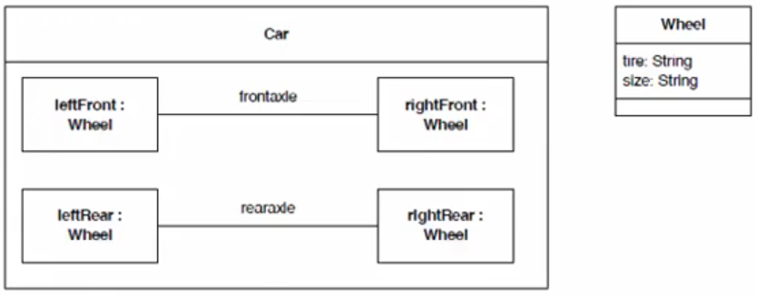
        * Pros
            + Well-suited for describing structure
            + Supports locality of data and encapsulation of properties
            + Supports structure-preserving implementation
            + Can model system decomposition
        * Cons
            + Ignores functionality and behavior (from a user's perspective)
            + UML: Deep nesting not possible within 1 diagram
    - 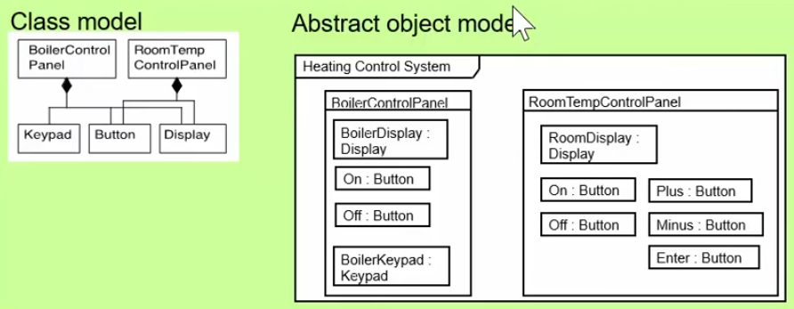

# Requirements Engineering Practices
1. Behavior Modeling
    - Goal: describe dynamic system behavior
        * Examples: How does it react to external events? How do components interact?
    - Means:
        * Harel statecharts /UML state machines
        * Sequence diagrams (mostly to model individual scenarios)
        * Final State Machines (FSMs) (not discussed)
        * Petri nets (not discussed)
1. State charts
    - 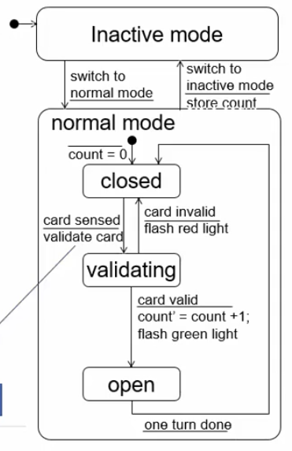
        * Black dot = starting state
        * 2x high-level modes
        * Normal mode has substates (closed, validating, open)
        * Arrows = transitions between states
        * ------ = trigger / reaction
    - Models dynamic behavior
        * How does the system react to external events?
        * Reaction depends on the actual state
        * State can be hierarchical (nested) or orthogonal (parallel)
    - In UML: state machine diagram
    - Pros
        * Global view of system behavior
        * Precise, but still readable (uses natural language)
    - Cons
        * Weak for modeling functionality and data
        * Not great for modeling timeout behavior
1. Sequence Diagrams
    - 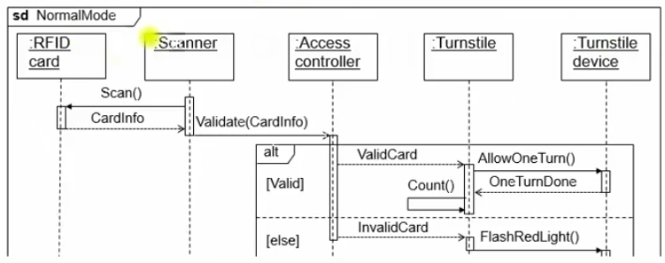
    - Models
        * the lifelines of system components and objects 
        * messages that they exchange
    - Terminology: UML
        * Older term: Message Sequence Chart (MSC)
    - Pros
        * Visualizes component collaboration/interaction on a timeline
    - Cons
        * In practice: only for required scenarios (otherwise - too complex)
        * Design-oriented => can detract from modeling requirements

# Function and flow modeling
1. What?
    - Activity models
    - Models Data/Information flow
    - Process and workflow models
1. Activity modeling
    - 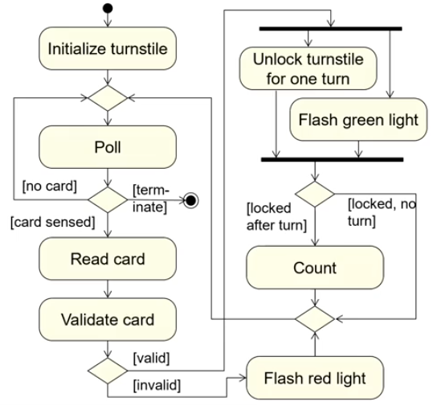
        * Legend
            + Oval = activity
            + Arrows = transitions/flow
            + Rhombus with 1 exit = join node
            + Rhombus with n exits = decision node (with conditions)
        * Models process activities and control flow
        * Can model data flow, but not great
        * Semantics based on Petri nets (transitions start when state is done)
        * Differences from statecharts
            + Have to manually model polling until a card is presented
            + Idea: flow of multiple tokens at the same time
            + Transitions fire after state is finished (no additional triggers like: wait for 5s)
1. Data and Information flow modeling
    - 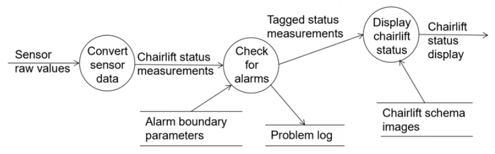
        * Things between --- = files
    - Models system functionality with data flow diagrams
    - Used more rarely today, but useful if data flow is important
    - Pros
        * Easy to understand
        * Supports system decomposition (can separate individual processes)
    - Cons
        * Outdated data treatment (no types, encapsulation, etc.)
            + can't be tied to classes or anything, just labels
1. Process and Workflow modeling
    - Elements
        * Process/Work steps
        * Events which influence the flow
        * Control flow
        * (optional) Data/Information access and responsibility
    - Typical languages: UML activity diagrams, BPMN, Even-driven process chains
    - Business Process Model and Notation (BPMN)
        * 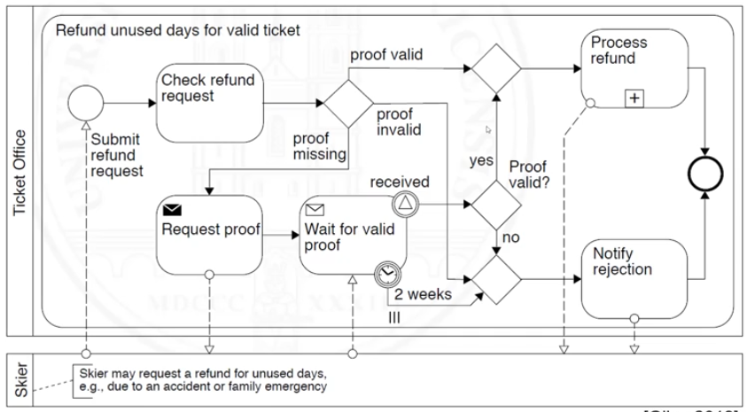
            + Start node = big white circle
            + Also has decision nodes
            + Separates responsibility (ticket office vs skier)
            + Adds more detailed labels
            + envelope symbol = communicate via email (black = send, white = receive)
            + clock symbol = timeout
            + plus symbol = connects to another process
1. Event-driven process chains (EPC)
    - 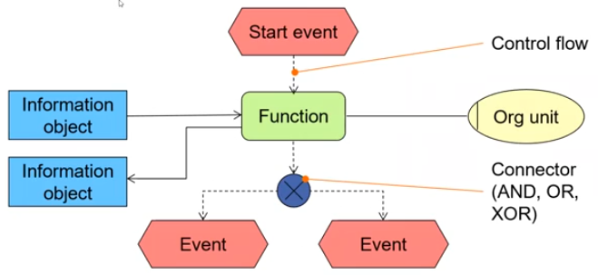
    - German invention: ereignisgesteuerte Prozessketten (EPZ)
    - Alternating function-\>event sequences

# User-system interaction modeling
1. Description of the system from a user's perspective
    - Key terms:
        * Use case
            + Description of possible interactions between users and system which provide added value
            + Example: buying a ticket
            + Specifies the system from a user's perspective: describes functionality that the system must provide
            + In a way a bundle for functionality
            + Use case diagrams (provide an overview)
            + Use case descriptions (provide the details)
        * Scenario
            + Description of potential series of events which leads to a desired/unwanted result
            + Ordered sequence of interactions between partners (system and external actors)
            + Instance scenario = concrete sequence
            + Type scenario (use case) = potential sequence
            + In UML: Execution trace of a use case
    - Representation options
        * Free text (natural language)
        * Structured text (natural language)
        * Statechart / UML State machine
        * UML activity diagram
        * Sequence diagrams (MSCs)
1. Modeling use cases
    - UML Use case diagram
        * 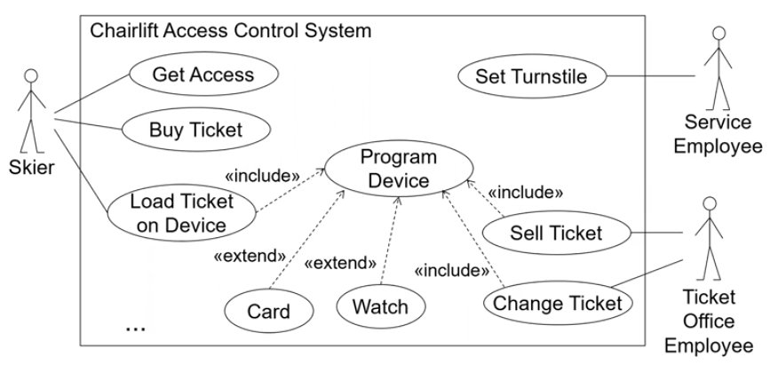
        * Pros
            + Provides abstract overview from the perspective of actors
        * Cons
            + Ignores required functions and data
            + Does not properly model hierarchies and dependencies
    - Modeling dependencies
        * UML can only do inclusion, extension, generalization
        * What about
            + control flow dependencies (sequence, alternative paths, iteration)?
            + hierarchy decomposition
        * Solutions
            + Use pre- and postconditions
            + Statecharts
            + Other older methods
    - Using pre- and postconditions
        * 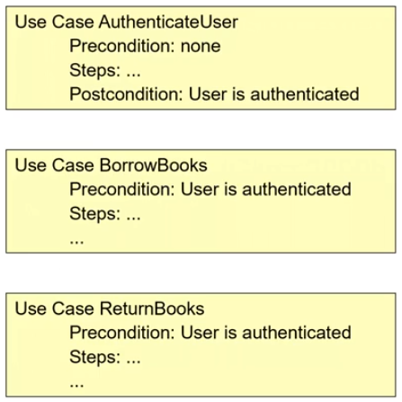
        * Can model simple sequences (post of A = pre of B)
        * Focus on descriptions, no overview of relationships
        * No hierarchical decomposition
    - Mini exercise: use case
        * 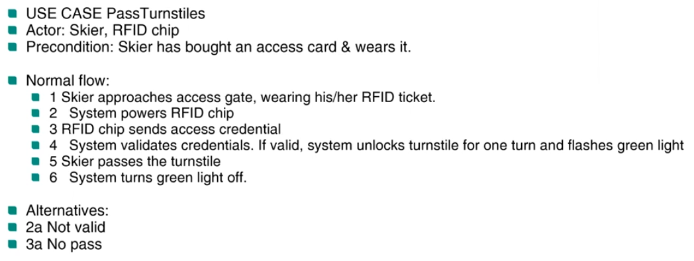

# Modeling goals
1. Basics
    - Helps go into the right direction and achieve shared understanding
    - Goals can be decomposed in sub-goals
        * Can provide context for lower-level requirements
    - Decomposition modeled using AND/OR trees
    - Considering multiple goals = directed goal graph
1. Goal Modeling
    - AND/OR trees
        * 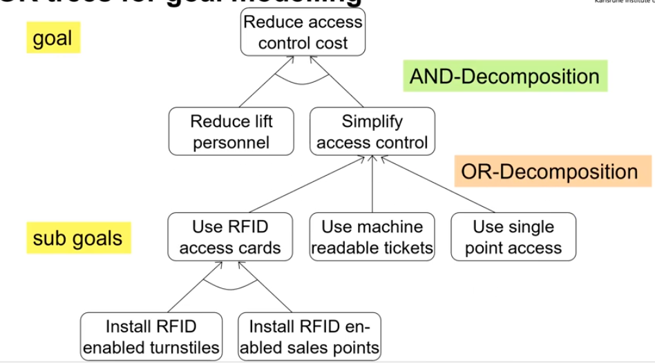
    - Goal-agent networks
        * Explicitly models agents, their goals, tasks which achieve the goals, resources and dependencies
        * i\* is the most used approach
1. Unified Modeling Language (UML)
    - UML specification = loosely connected diagrams of various types
    - Additional constrains using OCL (Object Constraint Language = formal textual language)
