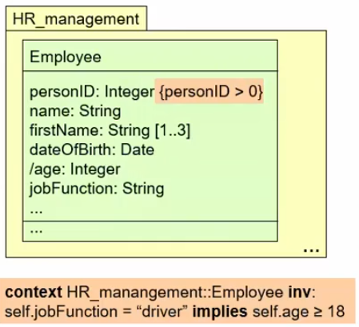
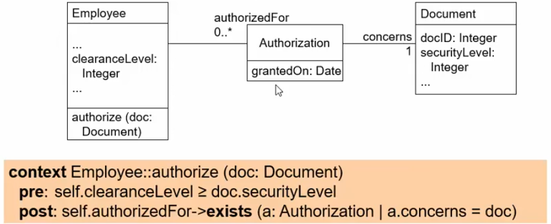
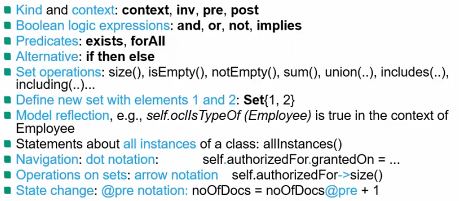

# Formal specification languages
1. What?
    - Requirements models with formal syntax and semantics
    - The vision
        * Analyze the problem
        * Specify requirements formally (no room for interpretation)
        * Implement using correctness-preserving transformation (transform model to application)
        * Maintain the specification, no need for the code
    - Typical languages
        * Pure Automata / Petri nets
        * Algebraic specification
        * Temporal logic: LTL CTL
        * Set & predicate-based models: Z, OCL, B
1. What does "formal" mean?
    - Formal calculus = a specification language with formally defined syntax AND semantics
        * Semantics = it's clear what the symbols mean and how to use them
    - Primarily for functional requirements

# Model-based formal specification
1. What?
    - Math model of system state and state changes
    - Based on sets, relations and logic expressions
    - Typical elements
        * Base sets
        * Relationships (relations, functions)
        * Invariants (predicates) = should always hold true
        * State changes (by relations or functions)
        * Assertions of states = things that should be true given a state
1. Overview of Z
    - 
    - Schemata
        * 
        * Organize a specification (basically a namespace)
    - Relations, functions and operations
        * 
            + Set of ordered tuples
        * 
            + Show state change
    - Example: Library system
        * Schema
            + 
        * Operation: borrow
            + 
            + changes the state
        * Query: availability
            + 

# Object Constraint Language (OCL)
1. What?
    - Textual formal language
    - Used to make UML models more precise
    - OCL expressions are attached to UML elements which add context (self)
1. Why?
    - Can specify invariants (i.e. additional restrictions) on UML models
    - Specifies the semantics of operations (pre- and post-conditions)
    - Can also be used to query UML models
1. Example: invariants
    - 
    - Can be part of the UML model (inline context is implicit)
    - Can be written separately (context is explicit)
1. Example: semantics of operations
    - 
    - -> = navigation from current object to a set of associates ones (set of documents)
1. Important constructs
    - 
    - Specifying what should change: self.var = self.var@pre...

# Proving properties
1. What?
    - Formal models let us prove that a model has some property (safety-critical invariants)
    - Classic Proof = property can be inferred from given logical statements
    - Model Checking = explores all states of a model and proves that the property holds for all of them
    - Pros
        * Model Checking is fully automatic and failures are basically counter-examples
        * Exploring the subset of feasible states = systematic, automated test
    - Cons
        * Classic Proofs are hard and labor-intensive
        * Exploring the full state space is often unfeasible

# Benefits, limitations and practical use
1. Benefits
    - Unambiguous per definition
    - Fully verifiable
    - Important properties can be
        * proved
        * tested automatically
1. Limitations / Problems
    - Expensive, but not much value?
    - Stakeholders cannot read them. How to validate?
    - Primarily for functional requirements
1. Practical application
    - Not used much
    - Reality
        * possible and reasonable for safty-critical components
        * Broad use
            + not possible (validation problems)
            + not reasonable (costs exceed benefit)
    - Alternative: use semi-formal models, but formalize critical parts
