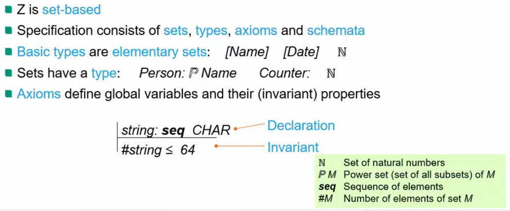
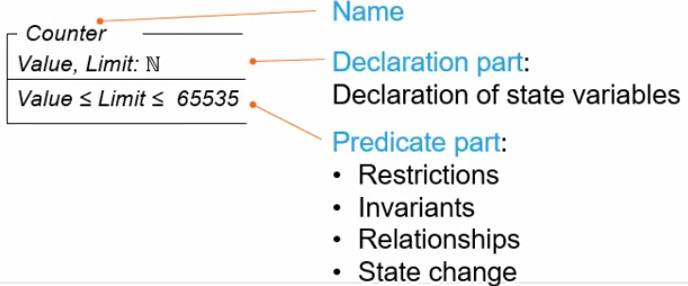
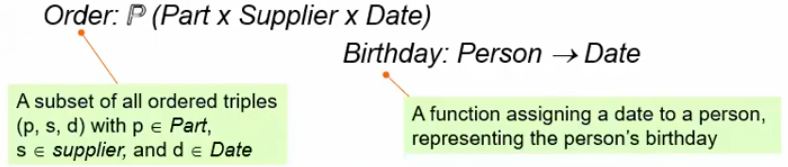
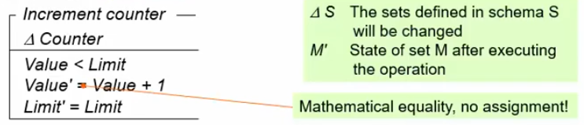
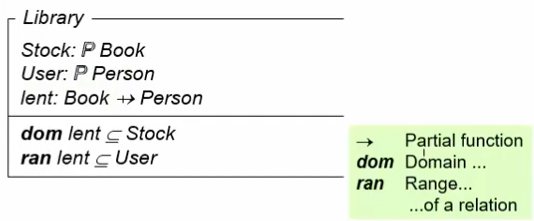
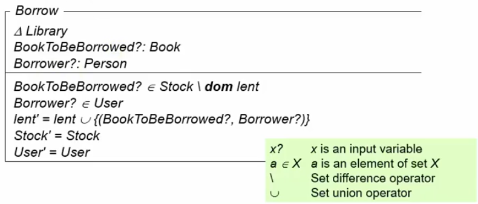
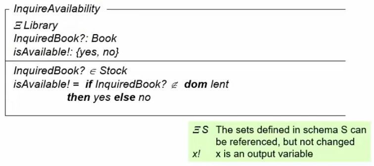

# Formal specification languages
1. What?
    - Requirements models with formal syntax and semantics
    - The vision
        * Analyze the problem
        * Specify requirements formally (no room for interpretation)
        * Implement using correctness-preserving transformation (transform model to application)
        * Maintain the specification, no need for the code
    - Typical languages
        * Pure Automata / Petri nets
        * Algebraic specification
        * Temporal logic: LTL CTL
        * Set & predicate-based models: Z, OCL, B
1. What does "formal" mean?
    - Formal calculus = a specification language with formally defined syntax AND semantics
        * Semantics = it's clear what the symbols mean and how to use them
    - Primarily for functional requirements

# Model-based formal specification
1. What?
    - Math model of system state and state changes
    - Based on sets, relations and logic expressions
    - Typical elements
        * Base sets
        * Relationships (relations, functions)
        * Invariants (predicates) = should always hold true
        * State changes (by relations or functions)
        * Assertions of states = things that should be true given a state
1. Overview of Z
    - 
    - Schemata
        * 
        * Organize a specification (basically a namespace)
    - Relations, functions and operations
        * 
            + Set of ordered tuples
        * 
            + Show state change
    - Example: Library system
        * Schema
            + 
        * Operation: borrow
            + 
            + changes the state
        * Query: availability
            + 
