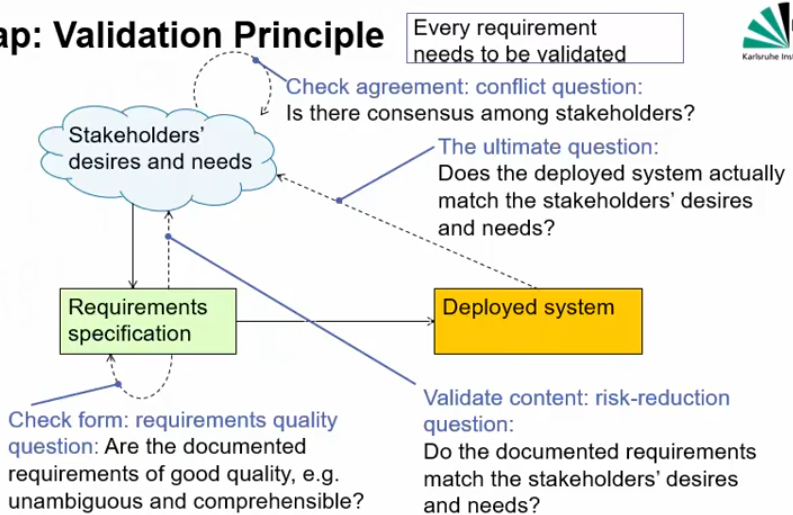

# Validating requirements

1. Principles
    - Every requirement needs to be validated
    - Validate content, form of documentation and agreement
    - Establish short feedback cycles
        * If you notice in validation, then it's easier to fix without many changes
    - Use appropriate techniques
    - Exemplify and disambiguate with acceptance test cases
        * Creating test cases helps see if stuff is unclear
1. Validation of content
    - Identify requirements that are
        * Inadequate (don't capture stakeholder needs)
        * Incomplete/Missing
        * Inconsistent (with each other or the stakeholders)
        * Wrong
    - Also look for quality defects
        * Not verifiable (can't tell if they hold even after deploy)
        * Unnecessary (stakeholders don't care about them)
        * Not traceable (where does it come from?)
        * Premature design decisions (details on how to build, while stakeholders don't care)
1. Validation of documentation
    - Check the documentation for formal problems (system requirements specification)
    - Identify requirements that are
        * Ambiguous
        * Incomprehensible
        * Don't conform to documentation rules, structure, format
1. Validation of agreement
    - Elicitation involves achieving consensus among stakeholders
    - While validating requirements: need to check if that is true
        * Are all conflicts resolved?
        * For all requirements: have all relevant stakeholders agreed to it in its documented form?
        * For all changed requirements: have all relevant stakeholders agreed to this change?
1. Validation principles
    - General
        * Work with the relevant people
        * Separate problem finding from fixing
            + Not everyone who finds should fix, otherwise they won't find
        * Validate from different views and perspectives
        * Validate repeatedly/continuously
    - Additional
        * Validate by using different types (check natural language by using models)
        * Validate by constructing artifacts (find problems by writing a user manual, test cases, etc.)

# Validation techniques
1. Review
    - Main technique
    - Walkthrough: author guides expert through the specification
    - Inspection: Experts check the specification
    - Author-reviewer-cycle: requirements engineer continuously asks feedback from stakeholders and changes stuff
1. RE tools: help find gaps and contradictions
1. Acceptance test cases: help disambiguate / clarify requirements
1. Simulation / Animation
    - Help investigate dynamic system behavior
    - Simulator executes the specification and may even visualize it (animate)
1. Prototyping
    - Prototype = sample model for the system to be
    - Lets stakeholders judge the practical usefulness of what was specified
    - Very powerful, but also very expensive
1. Formal Verification / Model Checking
    - Formal proof of critical properties

# Reviewing practices
1. Paraphrasing: The reviewer explains the requirement in their own words
1. Perspective-based reading: Analyze the requirements from different perspectives (end-user, tester, maintainer, etc.)
1. Playing and executing: Playing through scenarios or mentally executing acceptance test cases
1. Checklists: Using a checklist to structure the review process

# Acceptance testing
1. Definitions
    - Acceptance = The process of assessing, whether a system satisfies all its requirements
    - Acceptance test = A test which accesses ^
1. Relation between requirements and acceptance tests
    - Every requirement should have at least one acceptance test case
        * if not, then maybe the requirement is not that important
    - Requirements should be written in a way which makes it possible to write acceptance tests
    - Acceptance test cases can
        * help disambiguate requirements
        * be like detailed specifications by example
1. Choosing test cases
    - Requirement coverage: at least one case
    - Function coverage: at least one case
    - Scenario coverage: use case per type scenario (actions, branches)
    - Consider usage profile: not all functions/scenarios are equally frequent/important

# Requirements negotiation
1. The task of reaching agreement
1. Implies dealing with conflicts
    - Identification
    - Analysis
    - Resolution
    - Documentation
1. Can happen
    - while eliciting requirements
    - when validating requirements
1. Conflicts analysis
    - Identifying underlying reasons helps select resolution techniques
    - Typical underlying reasons
        * Misinterpretation = stakeholders interpret differently and disagree
        * Conflicts on the subject matter = divergent factual needs
        * Conflict of interest = divergent interests (cost vs function)
        * Conflict of value = divergent values and preferences
        * Conflict in relationship = problems in personal relationship between stakeholders
        * Conflict of organization = between stakeholders on different hierarchy and decision power levels in an organization
1. Conflict resolution
    - Resolutions must involve conflicting stakeholders
    - Win-win techniques (both conflicting parties are happy with the resolution)
        * Agreement = both agree to solution
        * Compromise = one stakeholder backs down
        * Build variants = build 2 versions of the system
    - Win-lose techniques
        * Overruling = more powerful one decides
        * Voting = democratic vote
        * Prioritizing stakeholders (important ones override less important ones)
    - Decision-support techniques (more so finding an agreement/compromise)
        * Plus-Minus-Interesting (PMI) = workshop where people come up with potential solutions and their 3 sides
        * Decision Matrix = rows: criteria, columns: alternatives, values: weights, sum columns
