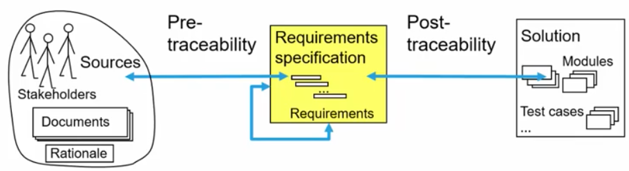

# Requirements Management
1. What?
    - Organize (store, retrieve, metadata (author, status, etc.))
        * Search for requirements relating to an area
    - Prioritize
    - Keep track: dependencies, traceability
    - Manage changes

# Organizing requirements
1. Requirement needs
    - A unique ID, so that it can be referred to
    - Metadata (author, date created, sources, status, priority)
1. Storing, retrieving, querying
    - Storage
        * Paper and Folders
        * Files and electronic Folders
        * Requirement management tools
    - Retrieving support
        * Keywords
        * Cross referencing
        * Search machine technology
    - Querying
        * Selective views (give me all requirements which match a query (including metadata))
        * Condensed views (statistics)

# Prioritizing requirements
1. Basics
    - Criteria
        * Necessity = how important / how much value does it bring
        * Cost of implementation
        * Time to implement
        * Risk
        * Volatility = how fast will things be changing
    - Prioritizing done by stakeholders
    - Can only pick a subset
    - Should be on the same level of abstraction
    - Priority != order of implementing
        * Priority: important to stakeholders
        * Order: based on priority and dependencies
        * Scrum: priority vs order in backlog
1. Simple prioritization (by necessity)
    - Rank all requirements in 3 categories with respect to necessity (importance for success of the product)
    - Critical (essential, mandatory)
        * If not met - system is unacceptable
    - Major (conditional, desirable, important, optional)
        * System should meet them, but also fine if not
    - Minor (nice-to-have, optional)
        * Implementing is nice, but not necessary
1. Single criterion prioritization
    - Simple ranking based on single criterion
    - Assigning points = stakeholders get n points to assign to m requirements
    - Prioritization by multiple stakeholders = weighted sum (based on importance)
1. Multiple criteria prioritization
    - Wiegers' Matrix: weighted priority based on relative benefit, detriment, cost and risk
    - Requirements Triage: select subset which optimizes probability for success given resource constraints
    - Analytic Hierarchy Process (AHP): algorithmic multi-criterion decision making process

# Traceability

1. Definition
    - The ability to trace a requirement
        * back to its origins
        * forward to its implementation (in design and code)
        * to its dependencies (and vice-versa)
    - Origins = stakeholders, documents, rationale, etc.
1. Establishing and maintaining traces
    - Manually
        * Requirements Engineer creates them when creating artifacts
        * Changes require maintaining traces
        * Need support from tools to make it easier
        * High manual effort; need to weigh cost and benefit
    - Automatically
        * Automatically generated between 2 artifacts (requirement spec and set of acceptances test cases)
        * Uses information retrieval technology
        * Requires manual post-processing of candidates

# Evolution of requirements
1. Goal
    - Try to keep requirements stable, while allowing changes
    - Every solution needs
        * Requirement configuration management
            + Versioning requirements
            + Creating configurations, baselines, releases
        * Requirement change management (with long development cycles)
            + Strict process how to change things
1. Requirement Change Management
    - Submit change request
    - Triage: OK, NO, Later (add to backlog)
    - If OK -> impact analysis
    - Submit result and recommendations to the Change Control Board
    - Change Control Board decides
    - If agreed
        * Make change
        * Create baseline/release
        * Adapt the contract between customer and supplier (if necessary)
