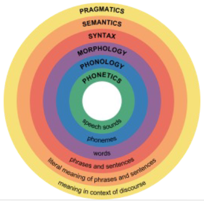

# Natural Language Processing (NLP)
1. What is it?
    - Processing, Analysis and Understanding of natural language
    - Understanding structure and meaning
    - Involves Computer Science, AI, Linguistics, etc.
1. Aspects
    - 
    - Understanding: Sequence Labeling
    - Generation: Sequence-to-Sequence Model
1. Tasks
    - Intermediate
        * Named entity recognition (NER)
        * Part-of-speech tagging (POS tagging)
    - Final tasks (products)
        * Machine translation
        * Chat bot
1. Topics
    - Ambiguity: need context to know what a sentence means
    - Compositionality: sunflower vs green thumb
    - Co-reference: If the baby does not like the milk, boil it
    - Language is evolving: Covid, Brexit, etc.
    - Rare Events: most words occur very few times
1. NLP Evolution
    - 1960: Experts manually created rules
        * Use language rules to parse sentences (subject, verb, objects depending on valence)
        * Problems: Languages changes over time (words change their POS, use words from other languages)
    - 1990: Use statistics to estimate stuff (POS tagging, NER, etc.)
    - 2010: Take model and train it on different data, depending on the task
    - 2020: One large model, trained on lots of data, can do multiple tasks
        * Automatically does feature extraction (or learns word embeddings)
        * Can pass task description AND input to the model
1. Learning scenarios
    - Supervised learning: labeled data
    - Unsupervised learning: unlabeled data
    - Semi-supervised learning: partially labeled data
    - Reinforcement learning: no individual labels, rather for whole data
1. Model types
    - Classification
        * Input: Fixed size
        * Output: label
        * Tasks: word sense disambiguation
    - Sequence classification
        * Input: Sequence of variable length
        * Tasks: sentiment analysis
    - Sequence labeling
        * Output: Labels for sequences of same length
        * Tasks: NER
    - Sequence-to-Sequence
        * Output: Sequence of variable length
        * Tasks: Summarization
    - Structure prediction
        * Output: complex structure
        * Tasks: Parsing

