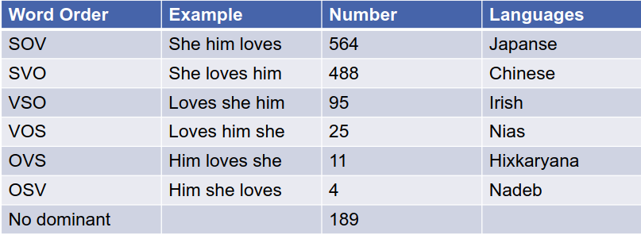

# Motivation
1. Syntax
    - Studies how words form larger units (phrases, sentences)
    - Differs between languages, but all languages have some principles
    - 

# Definitions
1. Word classes
    - Can replace words from the same class without a change in the structure
    - Part of Speech = word classes based on grammatical relationship
1. Part of Speech (POS)
    - Function depends on the context
        * Example: can (noun? modal verb?)
    - Universal Tag Set
        * Set of 12 POS Tags for all languages
    - Ambiguity
        * Words can have multiple POS Tags
        * Example: back
            + The back door = JJ
            + On my back = NN
            + Win the voters back = RB
            + Promised to back the bill = VB
        * Most word types have a single tag
            + 
            + frequent word types have more tags
            + rare words are often nouns or verbs
1. Syntactic constituency
    - Groups of words which behave as a single unit
    - Example: noun phrases
        * Can occur before a verb
        * 
    - Preposed / Postposed constructions
        * Only the entire phrase can move in the sentence
        * 
    - Phrases introduce hierarchical structures
        * Trees
        * 
        * Bracketing
        * 
1. Context Free Grammar
    - Introduced by Chomsky
    - G = (V,E,R,S)
        * V = finite set of non-terminals
            + Examples: NP, VP, etc.
        * E = finite set of terminals
            + i.e. words in the grammar
        * R = finite set of relations V -> (V + E)
            + Example: S -> NP VP
            + 
            + Lexicon = DT -> the (rules for terminals)
            + 
        * S = Start symbol
    - Applications
        * Generation
            + Generate sentence from start symbol
            + Top -> Down
        * Determining structure
            + Assign parse tree to sentence
            + Bottom -> Up
1. Parsing
    - Automatically generate a parse tree for a sentence
    - Idea: search for different parses, use a model to evaluate the quality of the parse
1. Treebanks
    - Syntactically annotated corpus
    - Example: Penn Treebank
1. Structure Ambiguity
    - Attachment ambiguity
        * What is a phrase attached to?
        * Example:
            + (I, (saw, ((the, man), (with, (the, telescope)))))
            + (I, saw, (the, man), (with, (the, telescope)))
    - Coordination ambiguity
        * Which things are joint?
        * Example:
            + [old [men and women]]
            + [old men] and [women]
1. Lexicalized Grammars
    - Challenges
        * Agreement (he speaks)
        * Subcategorization
        * Long-distance dependencies
    - Example: Combinatory Categorical Grammar (CCG)
        * Uses a lexicon and combination functions to describe a structure
        * Categories:
            + Atomic elements (e.g. NP, etc.)
            + Single-argument functions (arg = category, value = category)
            + (X/Y) = if Y is on the right, then return X
            + (X\Y) = if Y is on the left, then return X
        * Rules
            + > = forward rule application
            + < = backward rule application
            + 
1. Dependency Structure
    - A different way to describe sentence structure
    - Idea: describe binary relations between heads and dependents
    - 
    - Advantages
        * Morphologically rich
        * Free word order (object can be anywhere)
        * Connection to semantics
    - Universal linguistic relations
    - 
        * Causal relations = syntactic roles with respect to predicates
        * Modifier relations = words modify the head
    - Basically a graph
        * G = (V, A)
            + V = Vertices = words
            + A = Arcs = relations
        * Restrictions
            + Connected
            + Has a designated root node
            + Acyclic
        * Projectivity
            + Usually no crossings (head is connected to all nodes between itself and the dependent)

# Language Models
1. Definitions
    - Automatically learn sentence structure
    - Goal: calculate the probability that a sentence was written by a native speaker
    - No clear separation between syntax and semantics
1. Statistical Models
    - Approach: Probability = Count / Data Size
    - Problem: sparse data (valid sentences which don't occur get a P of 0)
    - Idea: predict individual words instead of whole sentences
    - The Chain Rule
        * P(w1,...,wn) = multiply P(wi|w1,...,wi-1), i in [1,n]
        * P(A,B) = P(A)*P(B|A)
        * P(A,B,C,D) = P(A)*P(B|A)*P(C|A,B)*P(D|A,B,C)
        * Problems:
            + further probabilities are still 0
            + there are too many histories to compute
        * Solution:
            + only use the last x words from the sentence to calculate the history
    - Markov Assumption
        * Simplification: P(the|water is so transparent that) ~= P(the|transparent that)
        * P(w1,...,wn) = multiply P(wi|wi-(x-1),...,wi-1), i in [1,n]
    - Approaches
        * Unigram model (x=1 => consider probabilities of individual words)
        * Bigram model (x=2)
        * N-Gram
            + Insufficient to model language, because we need long-distance dependencies
            + Usually works though, because most of language has simple structure
    - Training
        * Try to maximize P(wi|wi-1) = count(wi-1, wi) / count(wi-1)
        * 
    - Other challenges
        * if unseen words - probability = 0 => average the ngram probabilities?

