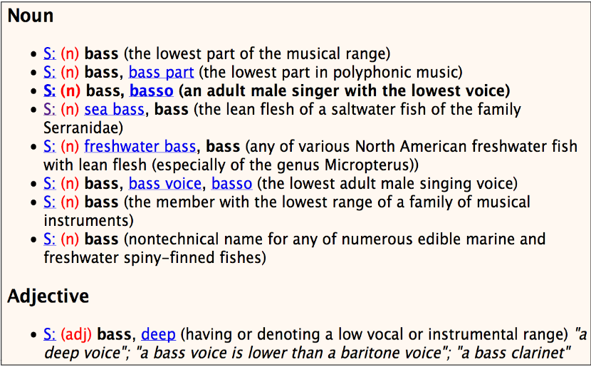

# Motivation
1. Study of meaning
1. Types
    - Lexical semantics = meaning of words
    - Compositional semantics = meaning of sentences

# Lexical Semantics
1. Basics
    - Lexeme = Abstract representation of a word (MOUSE = mouse, mice, etc.)
    - Challenge = Meaning can vary on context (animal vs computer tool)
    - Sense = Discrete representation of one aspect of the meaning
1. Semantic Word Relations
    - Synonym = Two words with (nearly) identical senses (couch/sofa)
        * Different linguistic form always implies a difference in meaning (H2O vs water)
    - Antonym = words with opposing meaning (long/short)
        * Differ in one aspect
        * Mostly adjectives
    - Taxonomic Relations
        * Hyponym = words which are more specific (car -> vehicle)
        * Hypernym = less specific (vehicle -> car)
        * Meronym = part-whole relation (wheel -> car)
    - The basic level is human-sized (things we know how to interact with)
1. Word similarity = score of how similar words are
    - SimLex-999 = human annotated pairs of words
1. Semantic field = context for a bunch of words
    * Example: Restaurant -> (Waiter, Menu, Plate, Chef)
1. Homonymy
    - Homonyms = words with the same form, but unrelated meanings
    - Homographs = same spelling, but different meanings
        * Bank, Bat
    - Homophones = same pronunciation, different meanings
        * Write/Right, Piece/Peace
1. Aspects of a word
    - Valence = pleasantness of stimulus (satisfied vs annoyed)
    - Arousal = intensity of emotion (excited vs calm)
    - Dominance = degree of control (controlling vs influenced)
1. WordNet = hierarchical lexical database
    - word meanings, aspects, relations, etc.
    - 
