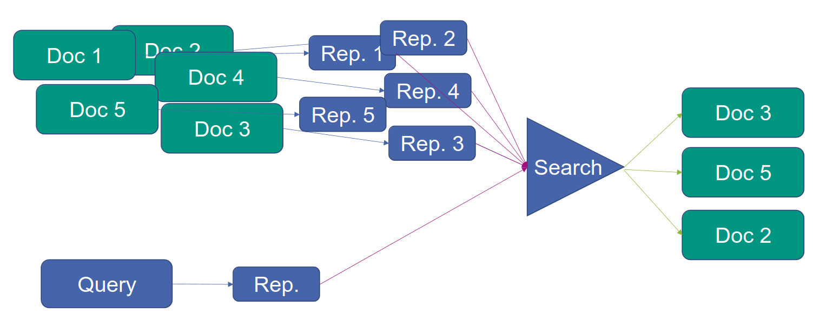
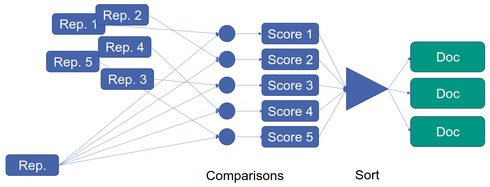
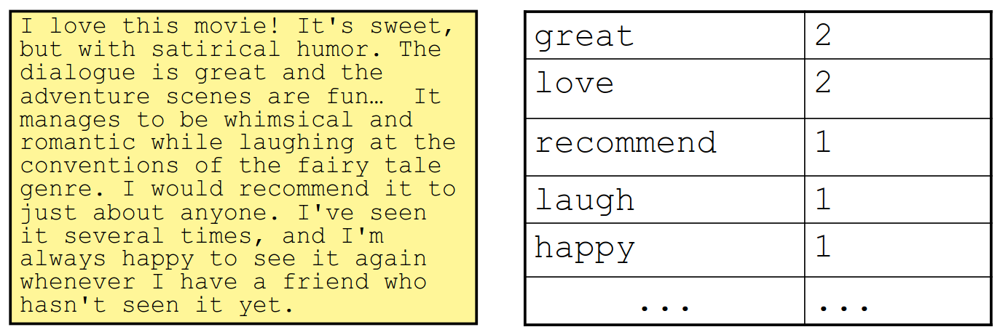
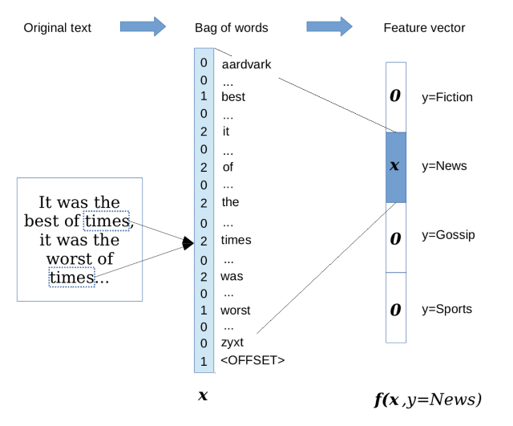
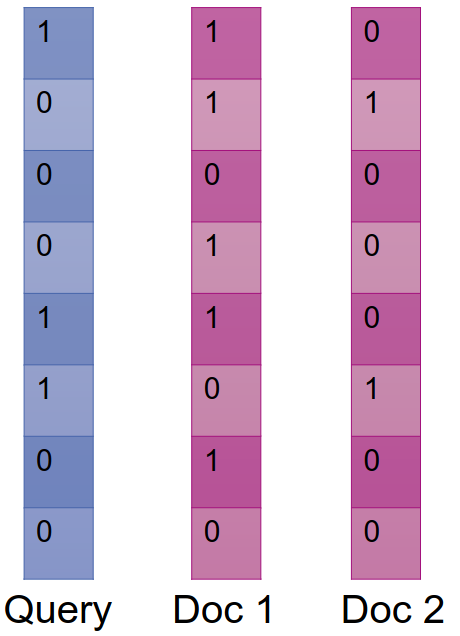
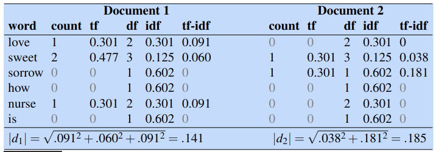
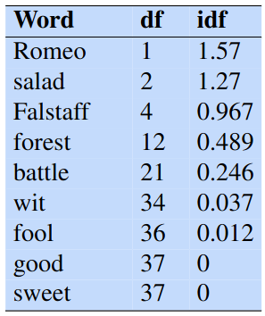

# Information Retrieval (IR)
1. Overview
    - 
    - Search = find most relevant documents
    - Result = ordered list of documents
    - Definitions
        * Retrieving media based on user information needs
        * Result = Search Engine
        * Ad Hoc retrieval = user poses query -> system returns questions
        * Data = Collection of documents (typically very large)
        * Document = unit of text (website, scientific paper, paragraphs), depend on the use case
        * Query = sequence of terms
    - Idea
        * Find representations for the query and the documents for further processing
        * Feature engineering = find important features
            + In traditional models - manually defined
            + In neural models - automatically learned
        * Result = fixed size vector
            + Continuous, dense = limited size
            + Binary, sparse = large size
1. Challenges
    - 
    - Large number of comparisons
    - Consequences
        * Independent representation of document and query
        * Fast comparison
        * Index to find relevant documents fast
1. Text representation
    - Goal
        * Represent text by a fixed vector
        * Model has fixed number of inputs
        * Math: R^n -> R^m
    - Approximation
        * Some information loss
        * Representation is task dependent
    - Challenges
        * Open vocabulary (new words created)
        * Variable length input (documents)
        * Word order matters
    - Describe important parts of the text
        * Feature engineering = manually defined templates
            + costly, hand-crafted, expensive, domain-specific
            + simple features give the bulk of the performance
        * Representation learning = automatically learned

# Document representation
1. Bag of Words
    - 
    - Document representation = vector of size (vocabulary)
        * 1 feature per word
        * feature value = some score
    - Challenges:
        * Open vocabulary => use fixed vocab
            + Depends on task at hand
            + Stopwords = most frequent, occur in every document
            + Unique words = cannot learn much (occur very rarely)
            + Solution: only use words with count between min and max
        * Variable length documents => ignore word position
            + aka order of words in vectors matters
    - Feature representation
        * Binary unigram features
            + f\_great(x) = does x contain "great"
            + Number of features = |V|
            + Values = {0, 1}
        * Count-based unigram features
            + g\_great(x) = count(x, "great")
            + Number of features = |V|
            + Values = N = {0, 1, 2, ...}
    - For document classification
        * 
        * Different words are important based on context/labels
        * Solution: take cross-product of V and labels
1. Feature Engineering
    - Representation
        * Sparse matrix = most entries are 0
        * Neural representation = dense
    - Issues
        * Words don't always indicate same sentiment
        * Great film = positive
        * Can be negative
            + Negation: not a great movie
            + Different sense: great deal of corny dialogue
            + Multiple sentiments: great ensemble cast can't carry the movie
    - Number of features is essential
        * Too few = can't distinguish inputs
        * Too many = overfitting
1. How are features used in IR?
    - Comparison
        * 
        * Input = feature vectors of query and documents
        * Goal = Estimate fit of vectors
        * Model
            + Calculate similarity
            + L2 of difference: sim(q,d) = sqrt((q-d)^2)^2
            + Cosine similarity: sim(q,d) = cos(q,d) = (q\*d) / |q|^2
    - Properties
        * Unsupervised = no annotated data
        * All features are equally important
        * Learn feature weights (supervised learning)
        * Use word importance
1. Term Frequency - Inverse Document Frequency (TF-IDF)
    - 
    - Term Frequency
        * Term occurring often in document is more important for the document
        * Definition: tf(t,d) = count(t, d)
        * Less important for bigger numbers: tf(t,d) = log10(count(t,d) + 1)
    - Inverse Document Frequency
        * 
        * Words occurring in less documents are useful for discrimination
        * idf(t,d) = log10(N/df(t))
        * Example: idf(the,d) = log10(N/df(the)) = log10(N/N) = 0
    - tfidf(t,d) = tf(t,d) \* idf(t,d)
    - BM25
        * Weighing scheme for tf-idf
        * K(nob) = Adjust balance between tf and idf
        * B = Importance of document length normalization
1. Efficiency
    - Problem
        * Millions of documents
        * Can't compute all scores
        * Most scores will be 0
    - Solution: Inverted Index
        * Input = term
        * Output = list of documents which contain it
1. Evaluation
    - Data used: Query, Document, Label, Relevancy
    - Most commonly used metric
        * Accuracy = number of correctly labeled documents / document count
        * Challenge: evaluation with rare labels
            + 1M documents, but only 10 relevant. Even if all wrong - still accuracy of 99.998%
    - Redefined accuracy
        * 4 possible outcomes per state
            + False positive (FP) = incorrectly predict label (NER, but not)
            + False negative (FN) = incorrectly fail to predict the label (not NER, but yes)
            + True positive (TP) = correctly predict label (NER and yes)
            + True negative (TN) = correctly predict that not label (not NER and not)
        * Accuracy = (TP + TN) / (TP + FP + FN + TN)
    - Recall
        * % of correct items which were selected
        * TP / (TP + FN)
        * If result = empty list => recall = 0
        * If result = all documents => recall = 1
    - Precision
        * % of selected items which are correct
        * TP / (TP + FP)
        * If result = empty list => precision = 0
        * If result = 1x correct => precision = 1
        * If result = all documents => precision = 10 / 1M
    - F score
        * Assesses the tradeoff between Precision and Recall
        * F = harmonic mean = ((beta^2 + 1) \* P\*R) / (beta^2 \*P + R)
        * A very conservative average
        * Usually beta = 1 => F = 2\*P\*R / (P + R)
        * Challenge: F score ignores ranking
        * Solution 1: interpolated precision
            + IntPrecision(r) = maxPrecision(i), i >= r
        * Solution 2: Mean average precision
            + AP = 1/|Rr| \* sum(Precision\_r(d))
            + Rr = relevant positions until r

