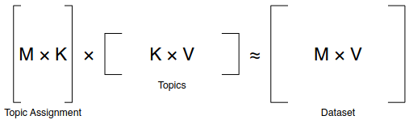
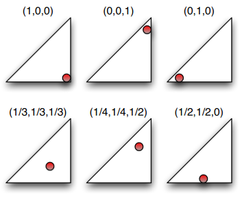
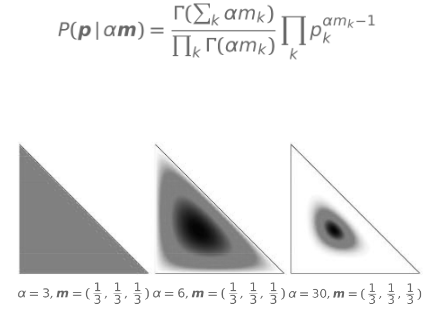
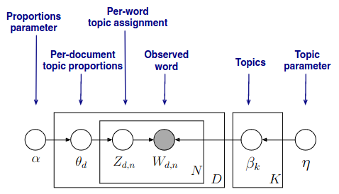
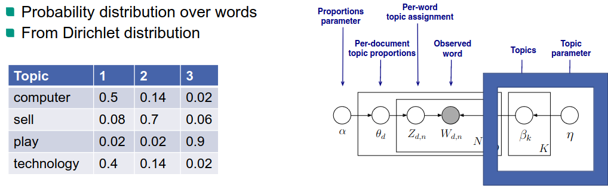
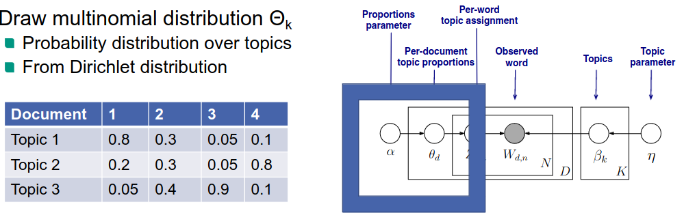
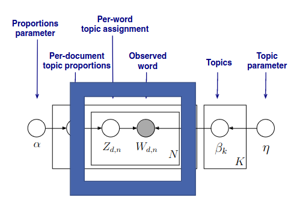
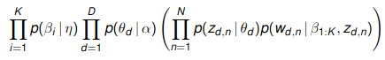
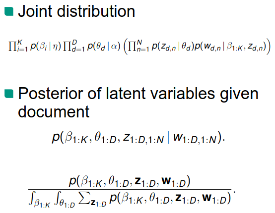

# Topic models
1. Motivation
    - Try to add a structure to documents (in order to organize)
    - Interested in semantic similarity
    - Example: group by topic
    - Goals: organize, understand, search, summarize
1. Idea:
    - Discover hidden themes
    - Annotate documents with those themes
    - Example: find most frequent words
1. Topics
    - Described by frequent words (distribution of words)
    - Rare words are more important, stopwords are less relevant
1. Topic extraction
    - Input: corpus; number of topics
    - Output: Topics; Document -> Topics mapping
    - Clustering = unsupervised
1. Approach 1
    - Dataset = collection of documents
    - Represent documents using |V|-dimensional vector
        * Example: TF-IDF
    - Document set = Matrix M x |V|
        * M = 
1. Matrix factorization
    - 
    - Method: SVD -> latent semantic analysis

# Probabilistic models
1. Assumption
    - Observe the data generated by the probabilistic process
    - Try to infer the original topic
    - Hidden variable = thematic structure
    - Basically: learn the topics in the database
1. Tasks
    - Visualize Hidden thematic structure
        * Infer hidden structure
    - Generalize to new data
        * Fit new document in topic structure (given the existing topics)
1. Latent Dirichlet allocation (LDA)
    - Latent: topic is unknown, latent in the text
    - Dirichlet
        * Distribution of distributions
            + Distribution of topics among documents
            + topic = distribution of words
    - Allocation
        * Allocate a topic to each word
    - Distributions
        * Multinomial distribution
            + 
            + Distribution over discrete outcomes (over set amount of topics)
            + Non-negative vector sum to one
        * Dirichlet distribution
            + 
    - Intuition: documents contain multiple different topics
    - Process: Infer topic for each word and find out topic distribution
    - Challenge: we only see the documents, not the topics
1. Graphical Model
    - 
        * Edges = dependencies
        * Squares = replications (how many of each)
        * For each topic
            + Draw multinomial distribution from dirichlet distribution
            + 
        * For each document
            + Same but for documents and topics
            + 
        * For each word position
            + 
            + Select a hidden topic
            + Select the word's distribution depending on the topic
    - Inference
        * Define posterior distribution
            + 
        * Infer
            + Topic assignment per word
            + Topic proportions per document
            + Topic distribution per corpus
        * Posterior inference
            + 
            + Challenge: cannot be computed
            + Solution: approximate using Gibbs sampling

# Gibbs sampling
1. Idea
    - Randomly give each word a topic
    - Change one assignment and recalculate its probability
1. Example
    - TODO: explain

# Measuring quality
1. Supervised learning
1. Unsupervised learning
    - Assign probability to data (distribution over documents)
    - Good model: high probability for real data
    - TODO: image
1. Evaluation
    - Word intrusion
        * TODO: explain
