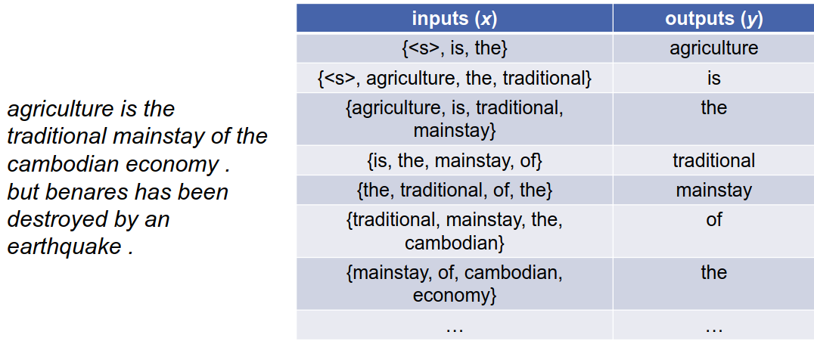
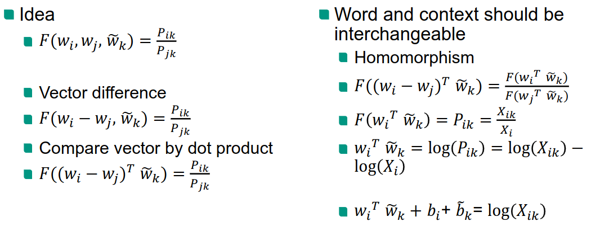

# Machine learning approaches to NLP
1. Traditional approaches: more hand-made/designed
1. Basics
    - Deep learning
        * Automates feature extraction
        * Uses smaller, but more dense representations
        * Representations can be reused between tasks (trained on lots of data and used where not as much data)
    - Perceptrons
        * 
        * Activation function lets us represent a series of sums as just one
        * Need fixed-size inputs, because other we don't know what weights to use
    - Multi-layer perceptron
        * 
        * Layers of perceptrons
    - Supervised learning
        * Calculate error function (output vs target)
        * Mean square error 
        * Cross entropy
    - Stochastic Gradient Descent
        * 
        * Try to minimize error function
        * Approach
            + Calculate current error
            + Calculate derivative with respect to parameter (weight) 
            + Update weight
        * Stochastic = only calculate for a subset of samples
    - Backpropagation
        * Needed to propagate the error back through the network
        * Calculates the contribution of each weight to the error
1. Input representation
    - Word encoding
        * 1 hot encoding
        * vector of length: vocabulary size
        * word has 1 at it's position in the vocabulary, otherwise - 0
        * Properties
            + All words are equally similar in the beginning (learned during training)
            + Large amount of features
    - Sparse vs dense vectors
        * Short vectors are easier to use as features (less weights to tune)
        * Dense vectors generalize better than storing explicit counts
    - Motivation
        * Learn dense representation
            + Semantically similar words should have similar representations
        * Local view
            + Predict words within the context (Language Model, Word2Vec, Fasttext)
        * Global view
            + Word co-occurrence matrices (Glove)

# Local view of words
1. Language models
    - Goal: estimate next word, given previous ones
    - Problems:
        * Most long sequences have not been seen
        * Back-ff to shorter sequences
        * Discrete Space
    - Neural networks
        * Map words to continuous word representation
        * Smooth function leads to better generalization of unknown n-grams
    - Feed-forward neural network
        * 
            + Uses same parameters in all layers (less parameters + learns more about words)
            + Input order is important, it's not a bag-of-words representation
        * Self-supervised learning (no labels, custom learning goal)
        * Model = classification problem
        * Input = n-1 last words
        * Output: probability of each word in the vocabulary being next
        * Better, because continuous space
            + Count-based models work in discrete space (expect exact match)
            + Words with similar context occur in same context => can predict probability for new words
        * 
            + Learn mapping between spaces
1. Word embeddings
    - Represent word in continuous vector space
        * 
        * Smaller dimension
        * Use to find word similarities
        * Automatically learn features which describe the words
    - Find nearest neighbor in continuous space
        * Syntactic similarities
        * Semantic similarities
    - N-Gram Language Models
        * Predict next word given context
            + Self-supervised learning
            + Trained on pure text
        * Meaning of word is important for estimation => needs to be encoded in the embedding
        * Requires many calculations. Can be more efficient?
1. Word2Vec
    - Beginning of deep learning: use simpler model to learn embedding
    - Two linear mappings shared among all words (no non-linearity)
    - Continuous Bag of Words Model (CBOW)
        * 
        * Predict word based on surrounding ones
        * Example:
            + 
    - Skip-Gram Model
        * Predict surrounding words
    - Score functions
        * Skip-Gram
            + 
        * CBOW
            + 
    - Negative Sampling
        * Use binary classifier
        * Gather positive and negative samples
    - Challenges
        * Morphologically rich languages (ignores internal structure)
    - Idea
        * Use sub-word representation
        * Character n-grams
    - Bag of n-gram representation
        * Set of characters
            + Example: follow = f l o w
            + Problem: follow & wolf have the same representation
        * Set of n-grams
            + house = ho ou us se
            + house = hou ous use
1. FastText
    - 
    - Word representation
        * Full word + character 3-6-grams
    - Word embedding = sum of subword embeddings
    - Hash n-gram to limit size

# Global view of words
1. Glove
    - 
    - Global look at whole corpus
    - Probability = of occurring in context
    - Ratio helps to identify correlations
    - 
1. Storing embeddings
    - Option 1: embedding = W * onehot(V, w)
        * W = word embedding matrix
        * V = vocabulary
    - Option 2: embedding = lookup(w)
    - Usually 2 is used, because it is much faster
