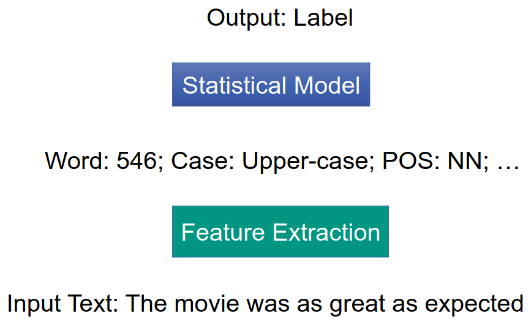
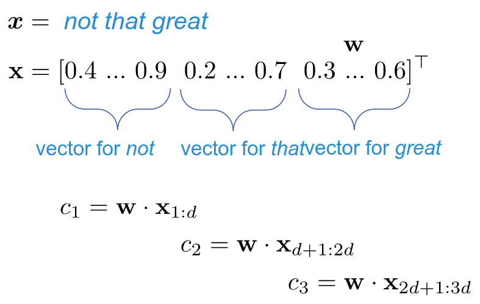

# Basics
1. Definition: Determine opinion, sentiment and subjectivity in text
1. Motivation: want to know what people think of something
1. Applications
    - Automatically maintain review and opinion-aggregation websites
    - Automatically analyze customer feedback
    - Predict public attitudes towards brand/product
    - Summarization
    - Question-answering
1. Challenges
    - Deep understanding (implicit comments)
    - Co-reference resolution
    - Negation handling
    - Different hints in text
1. Tasks
    - Polarity classification = positive or negative
    - Agreement detection = do 2 texts agree on a topic
    - Rating = predict user rating
    - Subjectivity detection = is the text subjective or objective?
    - Feature/aspect-based sentiment analysis = opinions on different features of a product
    - Viewpoints and perspectives = is the author liberal or conservative?

# Polarity Classification
1. Basics
    - Input = Text (Sentence, Document, several documents)
    - Output = positive or negative
    - Techniques
        * Keyword spotting
        * Lexical affinity
        * statistical methods
        * concept-based approaches
    - Model type: Sequence classification
        * Input = sequence of variable length
        * Output = label
    - ML challenges
        * Sequence order is important (end is more important, contrary to e.g. summarization)
        * Variable length sequences (NNs assume fixed-size representation)
        * Limited training data
1. Corpus-based approaches
    - 

# Deep Learning approaches
1. 
1. Basic model
    - 
    - Encoder
        * Compresses a word sequence to a vector
        * Word embeddings
            + Mapping: word -> dense vector
            + Challenge: most parameters
            + Typical application for a pre-trained model
        * Sequential layers
            + Simple approach: not a layer, but a bag-of-words representation
            + Ignores word order
        * Aggregation layer: Average
            + Average of the word embeddings
            + Effective encoder for text classification and more
            + aka neural bag of words (NBOW) or deep averaging network (DAN)
            + Others: sum, max, last element
    - Neural Network layers
        * Better representation of the sentence content
        * Input = fixed-size representation of the sentence
        * Output = fixed-size representation
    - Classification layer
        * Single Neuron: 2-class problem: outputs probability of class 1
        * Softmax layer
            + 1 neuron per class
            + activation = probability of the class
    - Training
        * Whole network is differentiable
        * Gradients flow through entire model
        * Random initialization
        * Frozen pre-trained model
        * Pre-trained model with fine-tuning
    - Challenges
        * Not all problems can be converted to fixed input and output
        * NLP requires context info
    - Requirements
        * Process words separately
        * Keep the context

# Feed-forward Neural Networks
1. 
1. Recurrent Neural Networks
    - 
        * Hidden state is computed from the actual value, weights, the previous state and a bias
    - Sometimes using aggregation: output = sum of hidden states
    - BackPropagation Through Time (BPTT)
        * 
        * Training method
        * Treat the unfolded network as one big feed-forward network
        * Unfolded network accepts whole input
        * Weight updates are computed for each copy in the unfolded, then aggregated and applied
    - Issues
        * Exploding/Vanishing gradient problem => normalization
1. Convolutional (Time-delayed) Neural Networks (CNNs)
    - 
    - Basics
        * Idea: perform same operation everywhere in the input in a systematic order (in chunks)
        * Use filters which are matched against positions in the input
        * Often used in NLP to convert sentence to a feature vector
    - Filters
        * = vector in the word vector space
        * matches = has high dot product with = particular region of the space z.B. prepositions?
    - Convolutions
        * 
        * Compare each word to a filter
        * Result = feature map = seq length \* #features
        * N-gram features: compare to n words (feature map = (seq length - n + 1) \* #features)
        * Aggregation layer = reduce to fixed length (e.g. max pooling)
    - Convolutional layer
        * = set of filters which are convolved with the input
        * Followed by more convolutional layers or pooling
        * Usually filters of varying length (1-5-grams)
        * Usually for character-level processing (filters look at character n-grams)
1. CNNs vs LSTMs
    - 
