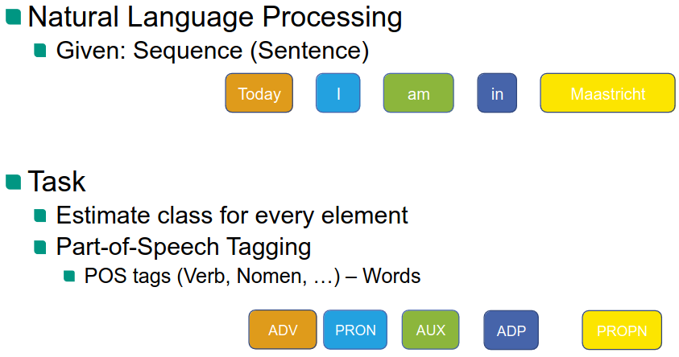
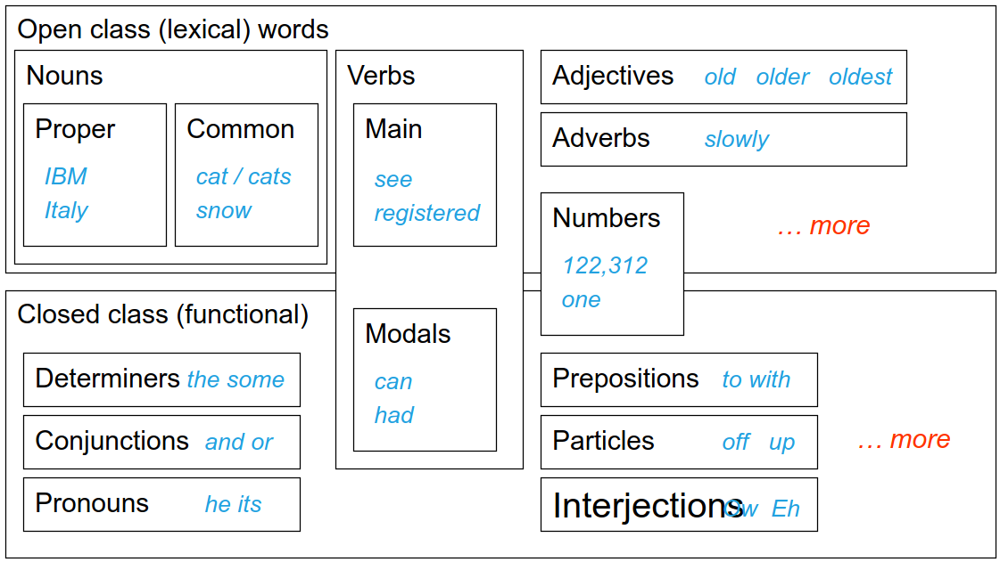
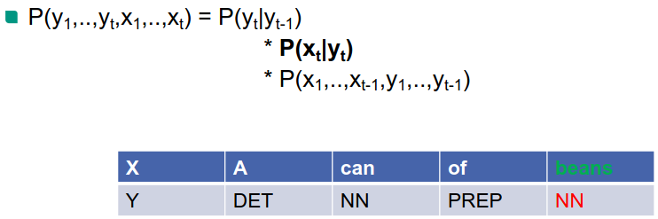
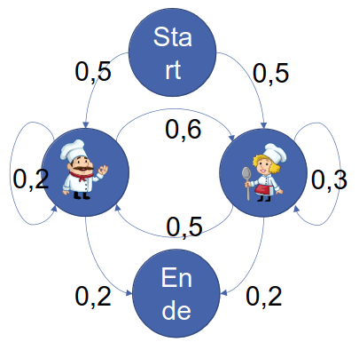

# Motivation
1. Language
    - Sequences of variable lengths (words, sentences, documents)
    - Properties depend on context
1. Example
    - 
    - Number of classes is fixed (POS Tags)
    - 1 to 1 correspondence

# Sequence Labeling
1. Basics
    - Input Sequence (var length) -> Output Sequence of labels (same length as input)
    - Example: Named Entity Recognition
    - Roughly: foreach input item -> predict a label
1. POS Tagging
    - 
    - Basics
        * Grammatical tagging
        * Word-category disambiguation
        * Mark based on definition and context
    - Ambiguity
        * Many words belong to multiple classes (have multiple POS tags)
        * Most words have only one tag (mostly nouns and verbs)
        * Frequent word types have multiple tags
    - Classification
        * First idea: use a classifier for each each word
            + Words are ambiguous, so need context (neighboring words/POS tags)
            + Need to jointly model the whole sentence
1. Probabilistic tagging
    - 
    - Model POS Tagging as Sequence Labeling
        * Input X = sequence of words
        * Output Y = sequence of POS tags
    - Machine Learning Problem
        * Training Data = pairs of words and tags: {(x1,y1), ..., (xn, yn)}
        * Learning = predict y given x
        * Problem: #Solutions = #tags ^ #words

# Hidden Markov Models (HMM)
1. Model basics
    - Generative model: assign joint probability to pairs of observations+labels
    - Markov assumption: the next state only depends on the current one
    - Independence of output: the output only depends on the current state
1. Markov Chains
    - 
    - Definitions
        * Set of states
        * Connections between states (weight = transition probability)
        * Start/End state
    - Often don't know the state => estimate based on observable
    - Example: observing meals of the day and estimating who is in the kitchen
    - In POS Tagging:
        * States = POS tags
        * Observations = words
1. Formalizing HMMs
    - Definitions
        * Q = q1, ..., qn (states)
        * A = aij (transition probability matrix)
        * O = o1, ..., ot (observations)
        * B = bi(ot) (output probabilities)
1. 3 challenges
    - Probability
        * Problem
            + Input = HMM lambda = (A,B) & observation sequence O
            + Output = Probability P(O)
        * Simplification
            + Idea: Calculate the probability of a given state
            + P(O|Q) = multiply(P(oi|qi)), i in [1 -> T]
        * Problem: Unknown State sequence
            + Weighted sum over all possible sequences (weight = probability)
            + P(O) = sum(P(Q) \* P(O|Q))
            + P(Q) \* P(O|Q) = multiply(P(qi|qi-1) \* P(qF|qT) \* multiply(P(oi|qi))), i in [1 -> T]
        * Forward Algorithm
            + 
    - Decoding
    - Learning

# Linear Chain Conditional Random Field (CRF)
1. Discriminative Models
    -  Model P(y|x)
1. Sequence Modeling
    - Model sequences of observations or labels
1. CRFs
    - Model join probability distribution over a set of random variables
    - Specifically: probability of label sequence given input one
1. Linear Chain Structure
    - Assumption that current label only depends on the observation and the previous label
1. Features
    - Used to find dependencies (functions which take the cur observation, cur and prev labels)
1. Parameter Estimation
    - Learned using maximum likelihood estimation
    - Adjusted during training

