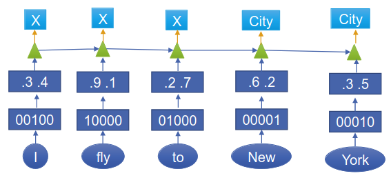

# Named Entity Recognition
1. Definition
    - Named Entity
        * entity represented by a name
        * e.g. person, organization, location, number, date, product
        * Usually introduced fully and then referred to in a short way
    - Named Entity Recognition
        * Find and Classify named entities in text
1. Motivation
    - Create indices and hyperlinks
    - Information extraction: build knowledge base (establish relationships between named entities)
    - QnA: Answers are often NEs
    - Machine translation: NEs require special care
        * NEs usually not translated
        * Things like numbers might require conversion (measuring units)
        * Names might require special transliteration
1. Difficulties
    - Labeled data is expensive
    - Requires lots of world knowledge  (Sheffield Wednesday F.C.)
    - Long context
    - Domain specificity
1. Using sequence labeling
    - One label per word (special class for non-entities)
    - Several words per slot
1. Span representation
    - 
1. Evaluation
    - Usual approaches
        * Precision = #correct / #retrieved
        * Recall = #correct / #all
        * F1 score = 2*precision*recall / (precision + recall) = harmonic mean of precision and recall
    - Example
        * 
    - Using token-level instead of phrase-level
        * Problems with phrase-level
            + punishes partial overlaps
            + ignores true negatives
        * 
        * Pros
            + Rewards partial overlaps
        * Cons
            + Longer entities carry more weight
            + Still ignores true negatives

# Sequence Labeling for NLU
1. Basics
    - 
    - Have to handle different outputs?
1. Neural Sequence Labeling
    - 
    - Input -> 1-hot encoding -> word embedding -> sequence layer -> classification (1-hot representations)
    - Missing aggregation layer, because we want one class per word
1. Challenges
    - Variable length of input and output
    - Relative position of words is important
    - Solution: Windowing
        * Consider previous m and next n words
        * => always m+n+1 inputs
        * Pad the beginning (and end?)
1. Convolutional Neural Networks
    - Don't use pooling, because something
    - Shift-invariant: where the NE is doesn't matter
    - Local context
        * Have to define how many words to look at
        * Same for all words
    - Independence of predictions: in HMM and CRF, labels depend from previous ones
1. Recurrent Neural Networks
    - 
    - 
    - Global context
    - Store history in fixed-size vector
    - Training
        * Backpropagation through time
        * Vanishing gradient problem
1. Long Short-Term Memory (LSTM) Network
    - 
    - RNN with long term memory
    - Cell state
        * 
        * Top lane
        * Stores information (memory)
    - Forget Gate
        * 
        * f = how much should we forget (close to 1 or 0)
        * if 1 or 0 - not differentiable?
    - Input Gate
        * 
        * i = how much should we write (same as f, but with diff weights and biases)
        * C = what should we write
    - Update cell State
        * 
    - Output Gate
        * 
        * o = how much should we output
        * h = what should be output
        * Next output does not depend on previous one!
1. Getting information from the future
    - Helps to disambiguate
    - Backward RNN
        * 
        * Reverses order, but then same problem with information from the past
    - Bi-directional LSTM
        * Idea: current state depends on both past and future
            + Problem: don't have info on the past (future) in the beginning (end)
        * Solution: run forward and backward and concatenate states
        * 
    - Deep LSTM
        * 
        * Stack several LSTM layers
        * Gradient flow problem => add residual connections
1. Self Attention
    - 
    - Idea: How do we store the state in a vector?
        * Sum of context items = same for all inputs
        * Solution: weighted sum
    - Intuition
        * For each state: query all others (how important are they for me?)
        * Calculate weighted sum using the result
    - Details
        * Weights = scalar product of query and key
        * Normalize using softmax
    - Multi-Head attention
        * Do attention with different weights
        * Focuses on different parts of the input
1. Positional Encoders
    - 
    - Problem: Representation ignores word positions
    - Solution: Encode position in word embedding
        * Add trigonometric function with different wave lengths to embedding

# Other Notes
1. Comparison with HMM(CRF)
    - Labels no longer independent
    - Continuous representation
1. Non-autoregressive models
    - 
    - Current output does not depend on previous one
    - Hidden state does though
    - Hidden state might have ambiguity
    - Problems
        * Repeated labels
        * Inconsistent labels
1. Autoregressive models
    - 
    - Mainly used for seq-to-seq and language models
    - Label bias = wrong decision propagates forward
