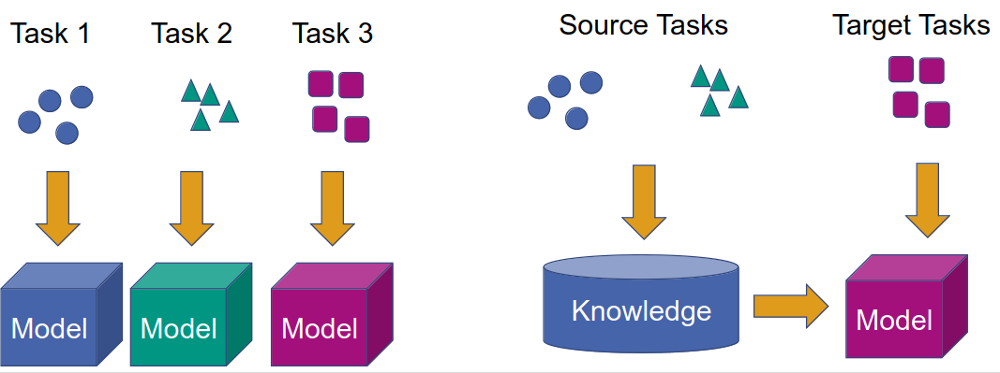
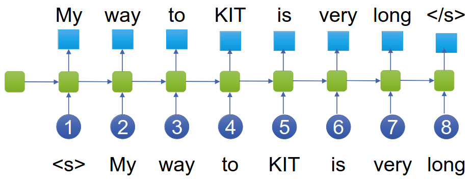
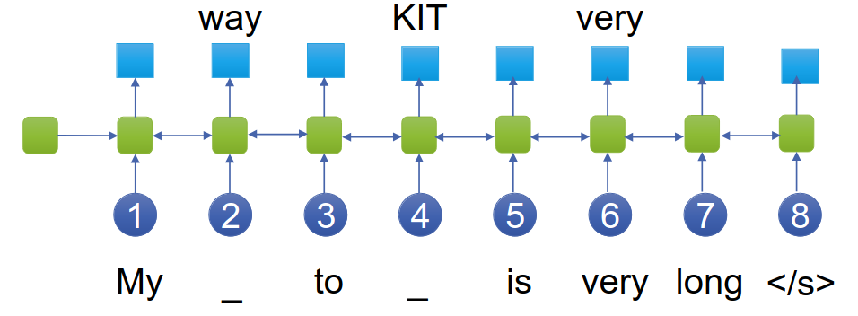
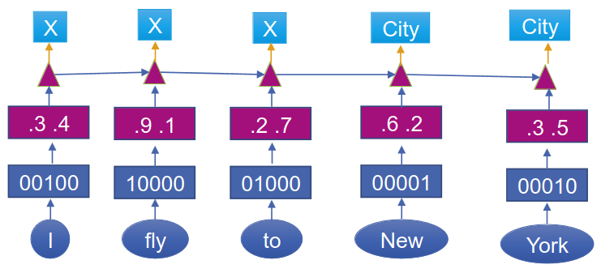
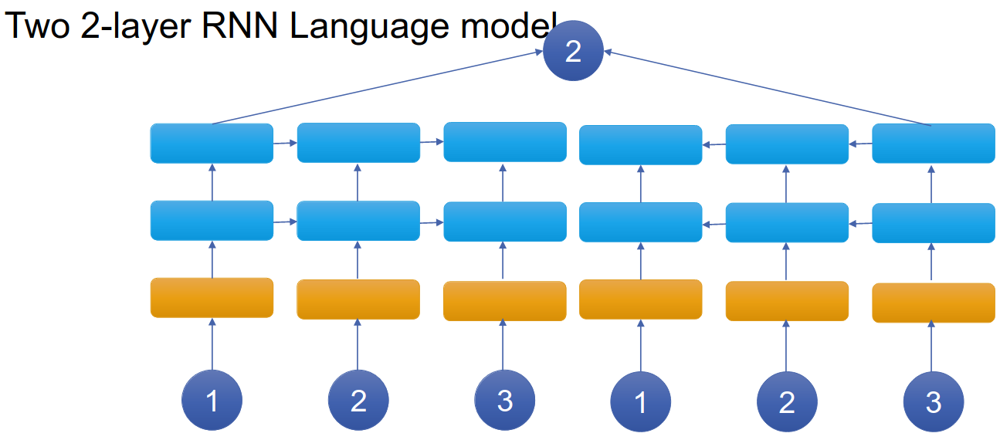
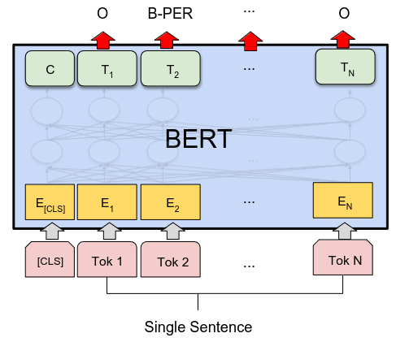
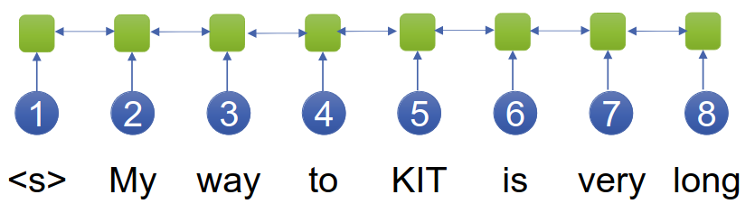
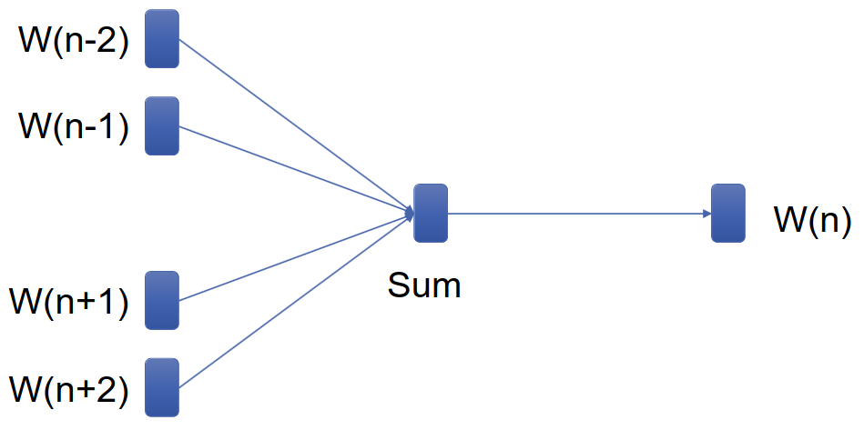

# Natural Language Understanding
1. Goal
    - Find a semantic representation of language
    - Basically: Translation from language to representation
1. Challenges
    - Ambiguities (Lexical/Syntax/Referential)
    - Vagueness (what is a late lunch?)
1. Dimensions
    - Depth: Shallow vs Deep
    - Domain: Narrow vs Open
1. Spoken Language Understanding
    - Approach: Transform language into task-specific semantic representation
    - Subtasks
        * Domain detection
        * Intention determination
        * Slot filling (basically gather parameters)
    - Examples
        * Show flights from Boston to New York
        * Set the alarm to 6 am
1. Domain Detection
    - Idea: create specialists on topics (call center analogy)
    - First technique: Create menu to find fitting agent
    - Automatic task: Automatically find agent (utterance classification task)
        * Input = Utterance
        * Output = Topic
    - Examples: Airline Travel, Alarm clock
1. Intent Determination
    - Domain-dependent utterance classes
    - Task: Assign class to utterance
    - Examples: Find\_Flight, Set\_Alarm
1. Slot Filling
    - Find attributes/parameters/slots for the intent
    - Task: Assign class to word spans (sequence labeling)
        * Neural Sequence Labeling (similar Named Entity Recognition)
        * Components
            + 1-hot encoding
            + Word embedding
            + Sequence layer (LSTM/self attention)
            + Classification (1-hot representation)
    - Problem: Need a lot of data because lots of parameters
    - Solutions
        * Collect data
        * Reduce amounts of parameters
        * Reuse parameters (use pre-trained word embeddings)
    - Examples: Departure,Arrival,Date; Time,Date

# Transfer Learning / Pre-training
1. Idea
    - 
    - Train model on unlabeled data
    - Reuse model for a related task
    - Example: Use word vectors in NER, SLU, ...
1. Challenges
    - What is a useful source task?
        * Should be similar to target task
        * Should have lots of data
    - How do we transfer knowledge to the target task?
        * Reuse parameters
1. Solution: Representation learning
    - Task: learn hidden representation
        * Should be transferable
        * Should have lots of data (unsupervised learning)
1. Self-Supervised Learning
    - Idea: Create supervised learning task from unlabeled data
    - General Approaches: Compression, prediction (missing, properties, relation)
    - Neural Approaches: Similar to next word prediction
        * Efficient training (several feedbacks per example)
        * Use an RNN instead of n-gram models
            + 
            + Sentence is shifted by one
        * Full text available from start => use bidirectional models
        * Use Self-Attention
            + Bidirectional per default
            + Can be made unidirectional using masks for future words (same parameters)
            + Can train 1/2 bi and 1/2 uni and then can use for both tasks
    - Masked Language Model Task
        * 
            + Sentence is no longer shifted
        * Idea: Automatically create supervised learning task
        * Bidirectional
        * Mask out some words and predict
        * Problem: No direct feedback for each input
1. Transferring knowledge
    - What do we share between tasks?
        * 
        * From Word embedding layer
            + Use same representation for each word
        * From Contextual word embedding layer (text encoder)
            + Use different representations
            + Share everything except classification head

# Pre-trained Models
1. Static Word Embeddings: Word2Vec, FastText, Glove
1. Contextual Word Embeddings: Bidirectional, EIMO, BERT
1. EIMO
    - 
    - RNN-based model
    - Trained using next word prediction
    - Embedding = weighted sum of two 2-layer RNNs
    - Can we use bidirectional models in pre-training?
        * Idea: Masking
1. BERT
    - 
    - Properties
        * Bidirectional Masking model
        * Self-attention framework
        * Next sentence prediction
        * Input using several sentences
    - Input representation
        * Subword units
        * First token
            + CLS used instead of aggregation layer to get info of sentence
            + SEP = sentence separator
            + A/B = embeddings for different sentences
    - Mask Language Model
        * Mask 15% of the subword tokens
            + 80% = MASK token
            + 10% = random token
            + 10% = unchanged
    - Next Sentence Prediction
        * Predict whether 2 sentences are consecutive
        * Based on CLS embedding
1. Bidirectional models
    - 
    - Processing
        * Input must be available
        * Non-autoregressive
    - Loss = Masking
    - Examples: BERT, Roberta, Albert
1. Application of Pre-trained models
    - Fine-tune a model on a target task
    - Only top layer vs all layers
1. ACE
    - Different pre-trained models have strengths and weaknesses
    - Idea: combine them by concatenating embeddings
    - Which do we choose?
        * Learn a model to tell us
1. Pre-trained word embeddings
    - 
    - Static = same representation for each instance of a word
    - Using word prediction: weighted sum of context words
