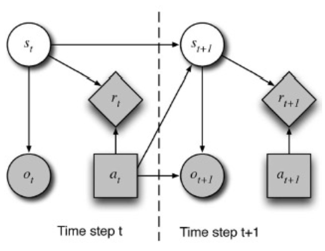

# Natural Language Generation
1. Sequence-to-sequence model
1. Examples
    - Machine translation
    - Dialog modeling / Chatbots
    - Summarization
    - Question-Answering
    - Paraphrasing
1. Traditional - Specific approaches per task
1. Deep Learning Based - seq-to-seq models

# Dialog Modeling
1. Overview
    - Classic Components of a (Spoken) Dialog System
        * 
    - Dialog Manager
        * Manages the flow of conversation
        * Input = semantic representation of the input (generated by the NLU)
        * Output = semantic representation of the output
        * Utilize additional knowledge
            + User info
            + Dialog history
            + Task-specific info
    - Challenges
        * Errors propagate through components
        * Need to find unambiguous representation
        * Hard to train on data (need specific data)
1. Types of Dialog
    - Goal-oriented Dialog
        * Follow a fixed set of goals (e.g. ticket vending machine, restaurant reservation)
        * Aim: reach the goal in as few steps as possible
    - Social Dialog
        * Conversational Bots
        * Most human
        * Small Talk conversation
        * Aims
            + generate interesting, coherent, meaningful responses
            + converse as long as possible
            + be a companion
1. Dialog Systems
    - Initiatives
        * System
            + Command and control
            + System prompts user for input
            + Example: S: What do you want to do? You can do x,y,z. U: I want x. S: Where do you want to go?
        * Mixed
            + Most natural
            + Both System and User can start interaction
        * User
            + 
    - Confirmation
        * Strategies for verifying/confirming information
        * Prompt: I want to go to X.
        * Explicit: Did you mean Y?
        * Implicit: When do you want to leave Y?
        * Alternative: Did you mean X or Y?
    - Development
        * 
    - Components
        * Dialog Model
            + Information about the system
            + Initiative, confirmation, kind of actions
        * User Model
            + Beliefs about stuff
            + User knowledge, expertise, experience
        * Knowledge Base
            + Information about the world and domain
        * Discourse Context
            + Information about dialog history and discourse

# Rule-based Systems
1. Types
    - Finite state
    - Frame-based
    - Agent-based
1. Finite State-based systems
    - 
    - Idea: iterate through states that define actions
    - Dialog flow
        * Specified as a set of dialog states (stages)
        * Transitions denote alternative paths
        * Nodes = dialogue states (prompts)
        * Arcs = actions based on the recognized response
    - Example:
        * 
    - Advantages
        * Simple to construct
        * Required vocabulary and grammar can be specified = more constrained ASR and SLU
    - Disadvantages
        * Restrict the user's input to predetermined words/phrases
        * Difficult correction of misunderstood items
        * User can't take initiative or introduce new topics
1. Frame-based systems
    - Idea: fill in slots in a frame that defines the goal
        * Slot/Form/Template filling
            + One slot per piece of information
        * Questions and other prompts
            + List of possibilities
            + Conditions need to be true for the question
    - Dialog flow: not predetermined, but depends on user input and info the system needs
    - Example:
        * 
    - Advantages
        * User can provide over-information
        * More natural dialogues
    - Disadvantages
        * Cannot handle complex dialogues
1. Agent-based systems
    - Idea: Handle communication as dialogue between two agents
        * Each agents can reason about their or the others' actions and beliefs
        * Use of "contexts"
        * Allows for complex communication and for user to control the dialog
    - Example:
        * 
    - Advantages
        * Allows for natural dialogue in complex domains
    - Disadvantages
        * Agents are usually very complex
        * Hard to build
1. Limitations
    - Expensive to build (lots of manual work)
    - Fragile to ASR errors
    - No self-improvement over time

# Statistical Dialog Models
1. Motivation
    - User intention not perfectly known
        * User does not specify it fully initially
        * Errors from ASR/NLU
    - Automatic learning of dialogue strategies
1. Advantages
    - Maintains a distribution of multiple hypotheses about the correct dialog state
    - Actions chosen using an automatic optimization process
    - Technology is not domain-dependent
        * Can be reapplied to another domain by learning domain data
1. Markov Decision Process (MDP)
    - A model for sequential decision making problems
        * Solved using dynamic programming and reinforcement learning
        * MDP-based SDM: Dialog evolves as a Markov process
    - Specified by tuple (S,A,T,R)
        * S = set of possible states
        * A = set of possible actions
        * T = transition model (between states)
        * R = local, real-valued reward function
    - Goal: Maximize the expected cumulative (discounted) reward
    - Note: Requires complete knowledge of S
1. Reinforcement learning
    - Learning through trial-and-error (reward/penalty)
    - Problems:
        * No direct feedback
        * Feedback only at end of dialog
    - Goal: Learn evaluation function from feedback
    - Idea:
        * Initially: all operations have probability 0
        * Dialog success => all operations positive
        * Dialog failure => operations negative
1. Partially Observable Markov Decision Process (POMDP)
    - MDP -> POMDP: cannot observe all states
    - POMDP-based SDM: reinforcement learning + belief state tracking
        * The dialog evolves as a Markov process
        * using belief state b(st), probability distribution of all states
        * SLU outputs a noisy observation of the user input with probability P(ot|st)
    - Specified by tuple (S,A,T,R,O,Z)
        * S,A,T,R = from MDP
        * O = finite set of observations from the environment
        * Z = observation function Z(ot,st,at-1) = P(ot|st,at-1)
    - Local reward => expected reward over the belief states
    - Goal: same as MDP
    - Operation: time steps
        * 
        * World is in unobserved state st
        * Maintain distribution over all possible states
        * DM selects action at based on belief state bt
        * Receive reward rt
        * Transition to unobserved state st+1 (only depends on st and at)
        * Receive observation ot+1 (only depends on at and st+1)
    - Update belief states
        * 
        * st = last state
        * st+1 = next state
        * at = last action
        * ot+1 = observation
    - Two stochastic models
        * Dialog model M
            + Models transition and observation probability
            + Keeps track of current state
        * Policy = find best next action
        * Optimized jointly
            + Maximize the expected accumulated sum of rewards
            + Online = interaction with user
            + Offline = training with corpus
    - Overview
        * Belief tracking
            + represents uncertainty
            + Pursues all possible dialogue paths in parallel
        * Reinforcement learning: use ML to learn parameters
    - Challenge: Belief Tracking (Belief state)
        * 
        * Information in the state
            + gt = User goals = info from user, needed to fulfill the task
            + ut = User utterance = what the user said (not what was recognized)
            + ht = dialogue history
        * Model
            + Observation model = probability of observation o given u
            + User model = probability of u given previous output and new state
            + Goal transition model
            + History model
        * Model too complex
        * n-best approach
            + approximate belief state by most likely states
            + e.g. Hidden Information State (HIS) model
            + partition similar goals, use same probability, split partitions
            + Problem: number of partitions grows exponentially with dialogue length
        * Factored approach
            + factorize goal into concepts, model complete distribution and only some dependencies
        * Combination also possible
    - Challenge: Policy
        * Mapping between belief states and system actions
        * Goal: find optimal policy pi
        * Problem: state and action spaces very large
        * BUT
            + only a small part of the belief state is visited
            + very restricted possible actions at each point
        * Summary space = simplified representation
    - Challenge: User Simulation
        * ML4SDM
            + learn optimal strategy from real dialog data
            + not enough annotated data for all states and strategies
            + no guarantee, that the optimal strategy is present in the training data
        * UsrSim
            + Train model on dialog corpus using "learning by example"
            + user model: dialog context -> real user responses
            + use model to predict responses to system actions

# Question - Answering
1. Traditional approaches
    - Text-based: use information retrieval to search for matching documents
    - Knowledge-based: build semantic representation of the query and retrieve answer from semantic databases
    - Knowledge-rich/hybrid: combine both
1. DeepQA / IBM Watson
    - 
    - Combines many approaches
        * Both text and knowledge based
        * Probabilistic question and context analysis
        * Extract answer candidates and apply rankers
    - Massive parallelism: Consider several interpretations at the same time
    - Document Collection Preprocessing
        * Access gigabytes of data in real time
            + Document indexing engine (e.g. Lucene)
            + TF-IDF
        * Allow fast, but coarse selection: more thorough rankers refine selection
        * Tagging, NER, chunking, semantic tags: searches can use this information
        * Integrate structured data: dbPedia, WordNet, Freebase
    - Question Analysis
        * Input: Natural language question
            + implicit: dialog state + user information
            + derived: POS-tags, NER, dependency graph, syntax tree, etc.
        * Output: Representation for
            + Information Retrieval: collection of weighted vectors or search terms
            + Answer Extraction: lexical answer type (person/company/acronym) and additional constraints
        * Constraints
            + Keyword extraction: expand keywords using synonyms
            + Statistical parsing: identify semantic constraints
            + Example: "When was Microsoft established?" -> Microsoft has to be the object of "establish"
    - Answer Type Classification
        * Classical approach: Question word (who=person,when=date,where=location,...)
        * Examples
            + Regex: Who {is|was|are|were} - Person
            + Question head word: take first noun phrase after the question word (which **city** in China...)
        * Problems
            + "who" can also refer to companies (who makes the Beetle?)
            + "which/what" is unclear (what was the Beatles' first hit single?)
        * Approaches
            + Manually created question type hierarchy
            + Machine learning classification
    - Candidate Document Selection
        * Most common approach
            + Conventional Information Retrieval search (using search indices, Apache Lucene, TF-IDF)
            + Several stages: coarse-to-fine search
        * Result = small set of documents for detailed analysis
        * Decisions
            + Boolean vs rank-based engines
            + How many documents should be retrieved?
        * Only retrieve the important part of the document
        * Passage retrieval = only return subsets of the document
        * Segment document (into coherent text segments)
            + e.g. topic-based text segmenter
            + re-rank segments
        * Combine results from multiple search engines
        * Text-based systems
            + only use syntactic information like n-grams (e.g. TF-IDF)
        * Knowledge-based / semantic-based systems
            + Extract information from the question to build a semantic representation
            + Construct query for semantic database
            + Not raw or indexed text corpus
            + Examples: WordNet, Wikipedia Infoboxes, FreeBase
    - Candidate Document Analysis
        * Named Entity Tagging (often including subclasses (towns, cities, provinces, etc.))
        * Sentence splitting, tagging, chunk parsing
        * Identify multi-word terms and variants (e.g. Barack Obama, (US) President, Obama, ...)
            + re-index and re-rank
        * Represent relation constraints of the text (e.g. logical language)
    - Answer Extraction
        * Input
            + representations for candidate text segments and question
            + rank set of candidate sentences
            + expected answer types
        * Find answer strings that match the answer types
            + extractive = answers are substrings in the document
            + generative = answers are free text (NLG)
        * Rank the candidate answers (e.g. overlap with question)
        * Return results with best score
        * Example
            + Input: name the first private citizen to fly in space
            + Type: person
            + Text: ...
    - Response Generation
        * Rephrase text segment (e.g. resolve anaphors)
        * Provide longer/shorted answer (add context into the answer)
        * If answer too complex -> truncate or start dialog
