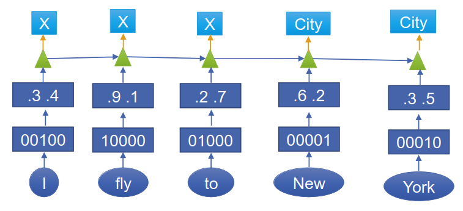
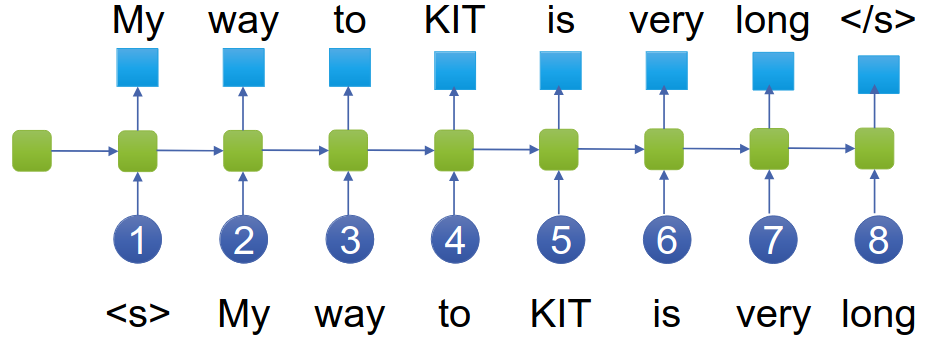

# Machine Translation
1. Definition
    - Translating from source language to target one using a computer
1. Use cases
    - Assimilation: Understand foreign text
    - Dissemination: Produce text in foreign language
    - Dialog
1. History
    - Warren Waver: Translation = decryption?
1. Challenges
    - Language is ambiguous (bank)
    - Different information in source and target
        * Lexical mismatch: fish -> pez (living in the water), pezcado (caught)
        * Less information -> More information
    - Same information in source and target
        * Structural divergence: Word order (a delicious soup -> una sopa deliciosa)
        * Categorical divergence: Noun -> Adjective
    - Co-reference
        * Anaphora: pronouns (he, she, it)
        * Deictic reference: here, now, I
        * Using synonyms, hyponyms
    - Changes over time
        * New words: Brexit
        * Borrowed words: download, gedownloaded
        * Social media: tmr
1. Approaches
    - 
1. Vauquois Triangle
    - 

# Sequence-to-sequence models
1. Sequence Labeling
    - Input = Text Sequence with variable length
    - Output = Label Sequence of same length
    - Example NER
        * Input = I fly to New York with American Airlines
        * Output = X X X CITY CITY X COMPANY COMPANY
    - Single Neural Network trained end-to-end
        * 
        * 1-hot encoding -> Word embedding -> Sequence layer -> Classification layer
        * Sequence layer = LSTM, CNN, Transformer
        * = Non-autoregressive (output does not influence next state)
1. Sequence-to-Sequence tasks
    - Tasks: Question-Answering, Dialog, Machine translation
    - Output = variable length
    - Traditional approaches: various task-dependent models to score output
    - Challenges
        * How many words to predict? -> other model to predict output length
        * Dependence between predicted labels
            + Thank you = Danke schön = Vielen Dank != Danke dank
    - Comparison to HMM(CRF)
        * 
        * Continuous representation
        * Dependencies: Markov assumption, independence assumption
    - Problems with non-autoregressive
        * Hidden state might have ambiguity
        * Problems: repeated/inconsistent labels
1. Autoregressive model
    - 
    - Mainly used in seq-to-seq models and language modeling
    - Training = use correct labels
    - Testing = use predicted label + beam search
    - Problems: Label bias
    - Sequence labeling
        * 
        * RNN Language model
        * Label = next word
        * Motivation: generate output one token at a time
    - Sequence-to-Sequence
        * 
        * Language Model
            + P(W) = probability of word sequence
            + P(Wn|W1,...,Wn-1) = probability of next word, given previous ones
            + P(W) = multiply probabilities of each word given previous ones
        * Sequence-to-Sequence
            + P(O|I) = probability of output given input
            + Conditional language model (additional dependency on input for probabilities)

# Encoder-Decoder
1. 
1. Basics
    - Predict words based on previous ones and source sentence
    - Encoder = Read input and output a representation
    - Decoder = Generate target word by word
    - Input = fully available from the beginning
    - Output = generate word by word, depends on previous predictions
    - Single LSTM = use same LSTM for source and target
    - 2 LSTM = 1 for each
1. Encoder
    - 
    - Find representation for input as fixed-size hidden vector
    - LSTM-based
    - Wi = 1-hot encoding
    - Si = Word embeddings
        * Project the words into a continuous space
        * Keep proximities on syntactic-semantic space
    - hi = Recurrent hidden states
        * Recursively update the hidden states
    - Final state = memory/context vector
        * Contains all relevant information from the source sentence
        * Fixed-size
1. Decoder
    - 
    - Uses the encoder's output as input
    - LSTM-based
    - Samples next word
1. Training
    - Data: source and target sentence
    - Forward pass
        * Calculate activation of hidden states
        * Encoder = no output probabilities needed
        * Decoder = calculate output probabilities
    - Measure error
        * Error = cross entropy
    - Backward pass
        * Backpropagate error = Calculate each weight's contribution to the error
    - Update weights
        * Calculate new weights (old - error correction)
        * Stochastic gradient descent
        * Done in mini-batches: Averaged over several examples
        * Epoch = one iteration over the training data
1. Challenges
    - Long-range dependencies
        * Solution: store whole sentence in memory vector?
        * Bad for long sentences
        * Better: Attention
