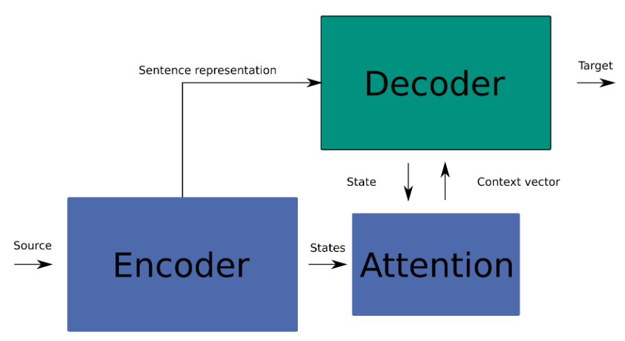
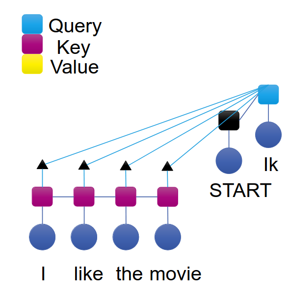
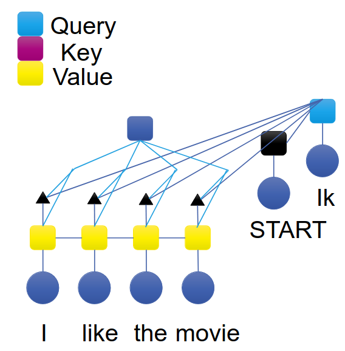
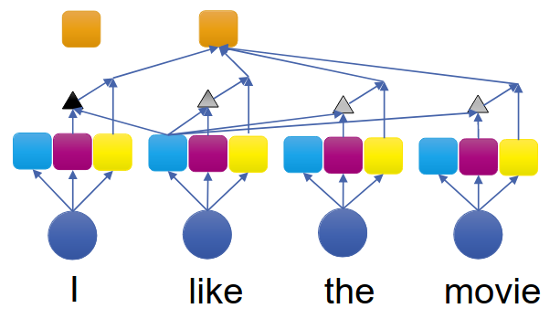
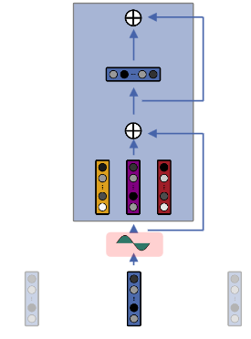
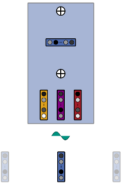
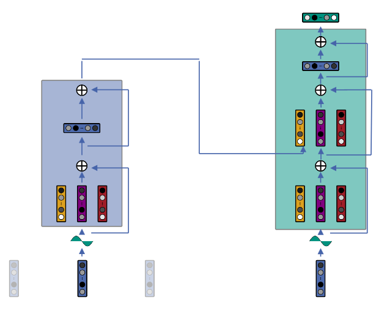
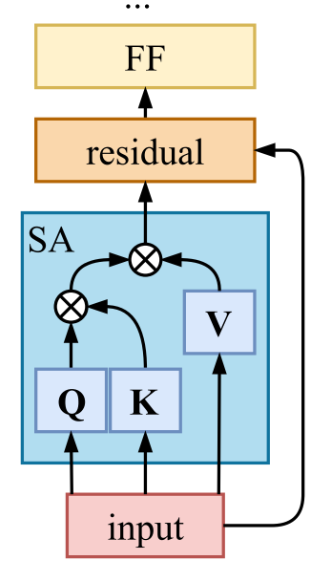

# Attention
1. Motivation
    - Problems of RNN-based Seq-to-seq models
        * Fixed-size representation of source sentence
        * Bottleneck context vector
        * Translation quality degrades with sentence length
    - Idea: only focus on most relevant parts of the input when decoding
    - Create a summary of the previous outputs at each step
        * Inspired by retrieval from a DB: use current element as a query
        * Find similar keys in DB (relevance = similarity between query and key)
1. Self-Target Attention
    - Encoder-Decoder Attention
        * 
            + Attention model = calculate context vector
            + Decoder = integrate context vector
        * Motivation: Creating summaries at each step of encoding
        * FAQ
            + How to calculate attention? -> Measure similarity between source and target state
            + How to integrate context vector into decoder? -> last output + context vector
        * Steps
            + Compare query and key
            + Score normalization
            + Calculate context vector using values
    - Comparison
        * 
        * Compare query (decoder state) and key (encoder state)
        * Input = decoder and encoder states (vectors)
        * Output = similarity (single value)
        * Goal: calculate Energy function
        * Methods
            + Scaled dot product = (Q . K) / sqrt(|K|)
            + Multiplicative = Q . W . K
            + Feed Forward Network = sigma(W . [Q, K])
    - Normalization
        * Goals
            + Normalize the energy to the probability distribution
            + Prevents vanishing/exploding gradients
        * Method: softmax(A(Q, K))
    - Context Vector
        * 
        * Goal: Summarize the values to a single vector
        * Method: Weighted sum based on attention
    - Integration of Context Vector in Decoder
        * Encoder-Decoder
            + Input = last hidden state and target embedding
            + Output = new hidden state
        * Attention Encoder-Decoder
            + Use hidden state to calculate context vector
            + Input context vector and target embedding
1. Self-Attention
    - 
    - Sequence representation
        * Sequential processing of input
            + Representation based on input and previous word representation
            + Same network at each position
        * Challenge: store history in a single representation of fixed size
    - Idea: focus on different parts of the sequence based on the current state
    - Steps
        * Calculate key, value and query for each input
        * Calculate similarity between query and key
        * Compute weighted sum of values
    - Multi-head attention
        * Focus on several types of information
        * Example
            + Input = I like the movie very much
            + very is important for much
            + like is important for much
    - Positional Information
        * John loves Mary != Mary loves John
        * Ideas
            + Integrate positional info in input
            + Use positional info in comparison
    - Positional Encoding (PE)
        * Encode position in word embedding
            + add trigonometric function with different wave length
        * Idea: inject position info in input sentence
        * Sinusoidal PE
            + 
            + Add parts of sinusoids of increasing wave lengths to input
            + Wave length depends on position
        * Relative PE
            + 
            + Idea: Inject positional info in attention scores of each layer
            + Not only in initial encoding
            + Knowing relative distance between query i and key j is enough
            + Absolute positions are recoverable from relative distances
1. Attention-based Seq-to-seq models
    - Transformer
        * 
        * First fully attention-based encoder-decoder model
        * Encoder = self-attention
        * Decoder = masked self-attention or encoder-decoder attention
    - Transformer layer
        * 
        * Blue = Self-attention (SA)
        * Orange = Residual
        * Yellow = Feedforward (FF)
    - Transformer Decoder
        * Similarities to Encoder: Embeddings, PE, Attention, FF
        * Differences from Encoder
            + Input = target sentences shifted to the right
            + Encoder-Decoder attention: key from encoder and query from current state
            + Self-attention only to the left (simulate left-right sequential decoding)
        * Training
            + Shift target sentence to the right by 1
            + Assume "ground truth"
        * Inference
            + Autoregressive, sequential
            + Cache previous key-value pairs
    - Possibilities for improvement
        * Query, key and value are projections from each input
        * Similarity between query and key = NxN matrix
        * Computing weighted sum of values
1. Efficiency/Scalability of Attention
    - Vanilla self-attention has quadratic complexity (to query and key length)

# Summarization
1. Basics
    - Apply encoder-decoder models to summarization
    - Challenges: training data and length of example
1. Applications
    - Articles, News
    - Emails, threads
    - Health information (clinical report)
    - Meeting summarization (create timestamps automatically)
1. Single- vs Multi-Document summarization
    - Different input size (1 document vs many documents/news stories/web pages)
    - Produce abstract/outline/headline/summary
1. Generic- vs Query-Focused summarization
    - Generic = summarize contents
    - Query = summarize based on user query
        * Usually requires longer, more descriptive and informative answers
1. Extractive summarization
    - Select subset of existing text segments (only deletion allowed)
    - Sentence/key-phrase extraction
    - Simpler, less grammatical/fluent
1. Abstractive summarization
    - Use NLG to create summary
    - Rewrite inputs
    - More human-like
