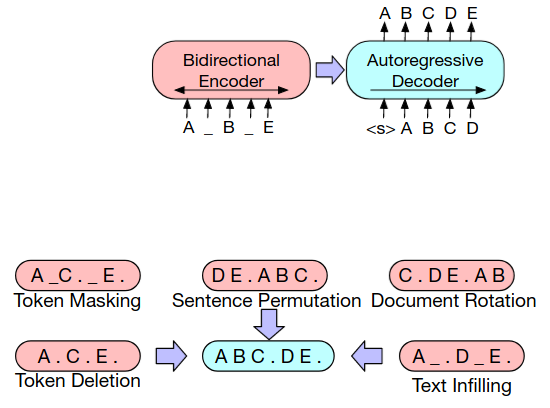

# Large Language Models (LLMs)
1. Other NLP Models
    - Corpus-based: Input -> Feature extraction -> (Word ID, Case, POS, etc.) -> Statistical Model -> Output
    - Deep learning: Input -> Feature extraction -> Bit encoding (one hot) -> Statistical Model -> Output
1. Large Language Models
    - Pre-trained on large amounts of data
    - Perform multiple tasks
    - Zero-shot: perform unknown tasks

# Architectures
1. Sequence-to-Sequence view
    - Encoder-based Models
        * 
        * Bidirectional
        * Loss = Masking (part of the input)
    - Decoder-based Models
        * 
        * Unidirectional
        * Loss = Next word prediction
    - Encoder-Decoder Models
        * 
        * Bidirection Encoder, Unidirection Decoder
        * Loss = Masking
1. Decoder-only
    - Self-supervised learning (Next word prediction)
        * Efficient training (Several feedbacks per example)
    - Architectural disadvantage
        * No separation of input & output
        * Uni-directional processing
1. Encoder-Decoder Models
    - BART
        * 
        * Corruption of the input sequence
            + Token Masking/Deletion
            + Sentence Permutation
            + Document rotation
            + Text infilling
        * Auto-regressive generation of output
    - PEGASUS
        * 
        * Additional objective: Gap Sentence Generation (GSG)
        * Selecting gap sentences:
            + Random
            + Lead = first n sentences
            + Principal = top n sentences by importance (token overlap)

# Training
1. Transfer Learning in Deep Learning
    - 
    - Example: Named Entity Recognition
        * Final fine tuning:
        * Train linear projection from hidden state to classification head
        * #Parameters = hiddenSize \* Classes
1. Zero-shot abilities
    - Perform task: no examples or gradient updates
    - Rely on ability to predict most probable token
    - Generative: transform task into completion
    - Discriminative: compare different possible text sequences

# Prompting / Multitask
1. Prompting
    - 
    - Provide a prompt for the model to predict that would come next
        * Reformulate the NLP task as a sequence completion task
    - Comparison with Fine-Tuning
        * Fine-Tuning = give examples and update parameters
1. Prompts
    - Addition
        * Template = natural language sentence with slots for the input (x) and the answer (z)
        * Prompt = fill out x in template
    - Examples
        * Sentiment classification
            + Template = [x] Overall, it was a [z] movie.
            + Input = I love this movie
            + Prompt = I love this move. Overall, it was a [z] movie.
        * NER: [x1]. [x2] is a [z] entity.
        * Summarization: [x]. TL;DR: [z]
        * Translation: English [x], German [z]
    - Types
        * Prefix prompt = x entirely before z (see Translation)
        * Cloze prompt = z in the middle of the prompt (see NER)
1. Answers
    - Prediction
        * Use LLM to predict [z]
        * Z = Possible answers = whole vocabulary OR small subset
        * Filled prompt = replace [z] with one element from Z
        * Answered prompt = filled prompt with highest probability
    - Scoring function
        * Most common
            + Predicated likelihood of the language model
            + Problem: cloze prompts for right to left models
        * Others
            + Perplexity
            + Channel = conditional probability of the reversed direction
    - Shape
        * Tokens = single token
        * Span = short multi-token span, usually with cloze prompts
        * Sentence = long prediction, typically with prefix prompts for text generation
    - Mapping
        * 
        * Map prediction to an answer ID
    - Engineering
        * 
    - Manual design
        * Unconstrained space = all tokens of the language model
        * Constrained space = only allow certain terms (e.g. NER, multiple choice answering)
    - Techniques
        * Discrete Answer Search
            + Generate paraphrases of the answer (positive = good, brilliant, excellent)
            + Probability = sum over all paraphrases
        * Prune-to-search:  Automatically find the restricted set of possible answers
        * Label Decomposition: Decompose relation to its constituent words
1. Prompt Ensemble
    - 
    - Idea: use multiple prompts in parallel
    - Advantages: stabilize & combine complementary strength
    - Methods
        * Classification = uniform/weighted average, majority vote
        * Generation = joint decoding
1. Prompt Decomposition
    - 
    - Task = create several predictions
    - Approach = divide tasks and perform individual prompts
1. Prompt Composition
    - Composable task: use sub-prompt for sub-tasks
    - Example: relation extraction

# In-Context Learning (ICL)
1. Demonstrate answer with examples
    - 
    - Learn to perform the task through context
    - Few-shot learning
    - Challenges:
        * Sample Selection
            + What makes a good example?
            + Unsupervised learning: L2 distance / cosine similarity between example and input
            + Supervised learning: dense passage retriever, reinforcement learning
        * Sample Ordering
            + Unsupervised: Most similar examples to example

# Downsides of Prompt-based learning
1. Inefficient: The model needs to process the prompt every time it makes a prediction.
1. Poor performance: Generally performs worse than fine-tuning.
1. Sensitivity: To the wording of the prompt and the order of examples.
1. Lack of clarity: Not clear what the model learns from the prompt. Even random labels work.
