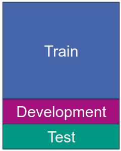
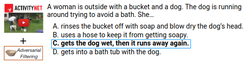
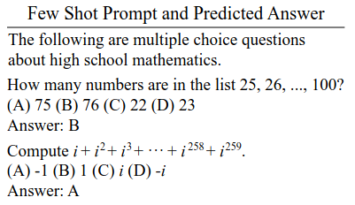
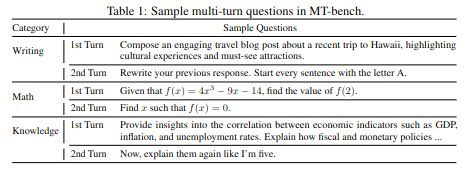
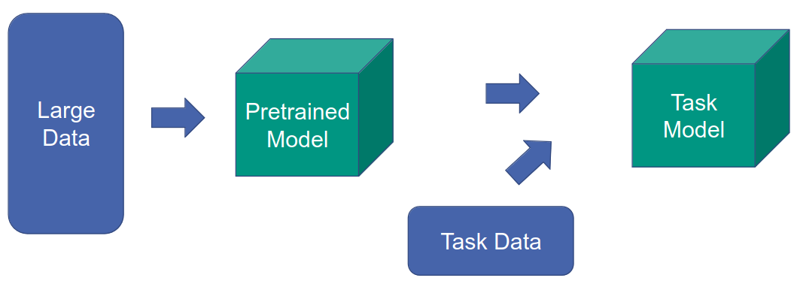
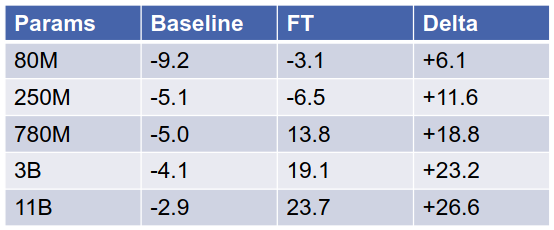
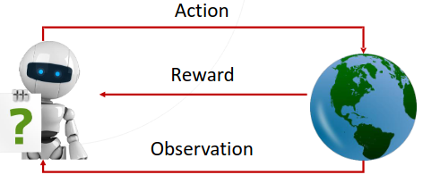
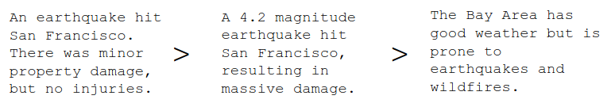
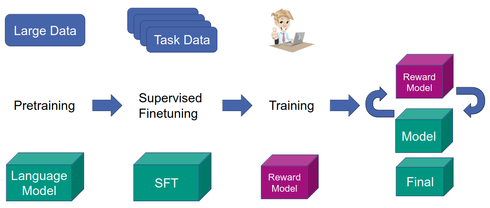

# Evaluating LLMs
1. Task-dependent evaluation
    - 
    - Predefined data split: training, development, test
    - Task-specific test set
        * Examples: Named Entity Recognition, Machine translation
    - Conditions
        * Constraint = predefined training data
        * Unconstraint = any training data
1. Evaluating large language model
    - Challenges
        * Unknown training data
        * Possible contamination with test set
            + Contamination = model might have already seen the test set
    - Solution: use new test sets
1. General Language Understanding Evaluation (GLUE) benchmark
    - Collection of 9 NLU tasks
        * Examples: Sentiment analysis, Textual entailment
    - SuperGLUE
        * Adds more tasks: Coreference resolution, Question answering
1. HellaSwag
    - Common Sense Natural Language inference
        * 
        * Given description - select most likely continuation
    - Adversarial Filtering
        * Iteratively select a set of machine-generated wrong answers
1. Massive Multitask Language Understanding (MMLU)
    - 
    - Multiple choice questions
        * 15904 questions
        * 57 areas: STEM (elementary maths), humanities (US history), etc.
1. Beyond the Imitation Game benchmark (BIG-bench)
    - 200+ tasks: traditional NLP, logic, math, code, world understanding, etc.
1. Conversational benchmarks
    - Examples
        * MT Bench = 80 high-quality multi-turn questions from 8 categories
            + 
            + multi-turn = same initial prompt, but ask more about it
        * ChatBot Arena = users interact with 2 anonymous models
    - Evaluation
        * Human Ratings
        * LLM-as-a-judge
            + Pairwise comparison (input = question and 2 answers)
            + Single answer grading
            + Reference-guided grading

# Instruction Training
1. Motivation: Large Language Models (LLMs)
    - Perform several tasks
    - Assist users
    - Communicate in natural language
1. Challenges
    - Unintended behaviors
        * Not following instructions
        * Making up facts
        * Generating biased/toxic text
    - Misalignment between
        * Training objective: next word prediction
        * Application: user assistance
1. Solution: Fine Tuning
    - 
    - Challenge: don't lose ability to do multiple tasks
1. Instruction Fine-Tuning
    - Input = collection of data + tasks given as instructions
    - Jointly fine-tune on all tasks
    - Idea: try to generalize for new tasks
    - Super-Natural Instructions
        * Expert instructions
        * 1616 NLP tasks from 76 types
        * Results
            + 
            + Normalized scores of 4 benchmark suits
            + Model = T5, Encoder-Decoder
            + Larger models get larger improvements
1. Open Challenges
    - Data collection
    - Ambiguity: no single correct answer
    - Mismatch: training = token-level mistakes, evaluation = larger mistakes
1. Idea: directly optimize human preference
    - Input
        * Language model (e.g. summarization)
        * Human ratings of samples
    - Goal = maximize expected reward
1. Solution: Reinforcement learning
    - 
    - Open Challenge: Human in loop is expensive
    - Solution: replace human with another model
1. Reward Model (RM)
    - Collect training data
    - Train RM to predict human rating
    - Apply RM during reinforcement learning to predict labels of new inputs
    - Training with pairwise comparison
        * 
        * Model should predict rating
1. Reinforcement Learning from Human Feedback (RLHF)
    - Given
        * Pretrained language model
        * Reward model
    - Initialize target model
    - Reward function = use reward model
1. Instruct GPT
    - 
    - Step 1: Supervised Fine-tuning
        * Task collection from labelers
            + Plain = select arbitrary tasks with sufficient diversity
            + Few-shot = come up with instructions and multiple query/response pairs for each
            + User-based = something about use cases and prompts
        * Sample prompt from the dataset
            + Example: Explain the moon landing to a 6-year-old
        * Ask labeler to demonstrate the desired output behavior
        * Use data to fine-tune GPT with supervised learning
    - Step 2: Reward Model
        * Sample prompt and several outputs from the fine-tuned model
        * Ask labeler to rank them from best to worst
        * Use this data to train the reward model
    - Step 3: RLHF
        * Sample prompt from dataset
        * Generate output using model
        * Evaluate output using reward model
        * Update the original model given the reward
    - Challenges
        * Challenge: As RLHF is updated, RM gives lower scores, because the output deviates from the expected
        * Solution: Add KL penalty to make sure the output does not deviate too much
        * Challenge: Just using an RL objective leads to performance degradation on NLP tasks
        * Solution: Add an auxiliary LM objective on the pretrained model
