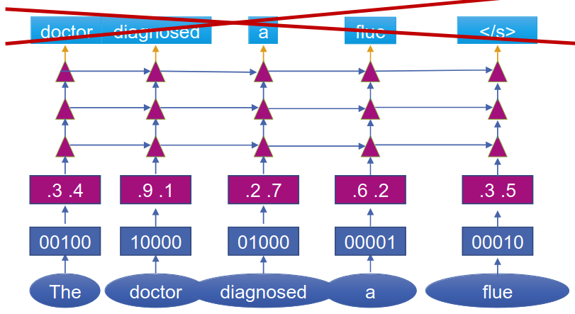
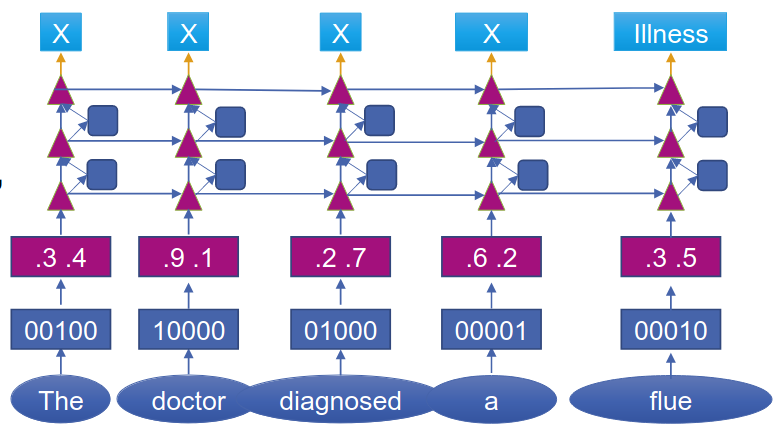
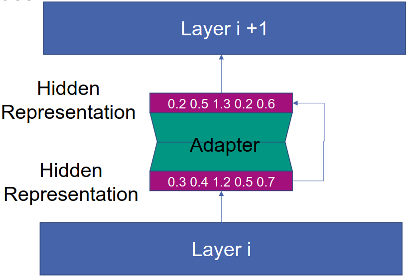

# Transfer Learning
1. Traditional vs Transfer
    - 
    - Try to build a general model from the data and try to do a target task
1. In Deep Learning for NLP
    - Task data = expensive
    - General Transfer Learning = 1000 examples
    - Few-shot Learning = 10-100 examples
    - One-shot Learning = 1 example
    - Zero-shot Learning = no examples
1. Types of Transfer Learning
    - 
1. Training
    - Task-specific encoder-decoder
    - Promptless Fine-tuning
        * No prompt
        * Fine-tune language model
        * Advantage: no prompt design
        * Disadvantage: need more data
    - Tuning-free prompting
        * Human-generated prompts
        * Frozen language model (don't update the gradient)
        * Advantage: efficient, possible to use LLMs
        * Disadvantage: prompt engineering, limited accuracy
    - Fixed-LM Prompt Tuning
        * Continuous and discrete prompts
        * Frozen language model
        * Advantage: efficient learning of prompts
        * Disadvantage: limited accuracy
    - Fixed-prompt LM Tuning
        * Human-generated prompts
        * Fine-tune language model
        * Advantage: Adapt to prompt style
        * Disadvantage: LLMs need to be updated (lots of parameters)
    - Prompt & LM Tuning
        * Continuous and discrete prompts
        * Fine-tune language model
        * Advantage: many degrees of freedom
        * Disadvantage: LLMs need to be updated

# Adaptation
1. Using Prompts
    - Motivation: template selection has a huge influence on the quality
    - Hand-crafted
        * Manually create templates
        * Advantages
            + No training data
            + Zero-shot
        * Disadvantage
            + Difficult
            + Maybe suboptimal
    - Automatic search
        * Discrete prompt: prompt is text
        * Continuous prompt: prompt is embedding
        * Static prompt: same prompt for each example
        * Dynamic prompt: prompt depends on input
    - Prompt mining
        * Input = pair of X and Y
        * Search for prompt based on X and Y
        * Example
            + X = Barack Obama
            + Y = Hawaii
            + Sentence = Barack Obama was born in Hawaii
            + Template = X was born in Y
        * Data source = large text corpus (e.g. Wikipedia)
        * Search = Middle words or decency paths (between X and Y)
    - Prompt Paraphrasing
        * Idea: Start with initial prompt and use automatic paraphrasing
            + Back-translation (translate to another language and then translate back)
            + Neural prompt rewriter (optimized to improve the performance of the final system)
    - Gradient-based search
        * Search for words to fill prompt
    - Continuous prompts
        * Idea: prompt does not need to be human readable = embedding
        * Motivation: Domain token in seq-to-seq models
        * Adaptation: Don't change language model itself
    - Prefix/Prompt Tuning
        * Prompt tuning = learn specific embedding
        * Prefix tuning = learn hidden representation of all layers
            + A lot more parameters (learn for each layer)
        * Tuning initialization = initialize with discrete prompts
1. Architecture Adaptation
    - 
    - Motivation
        * Adapting to structurally different task
            + Pre-train with simple input (language modeling)
            + Adapt to a task with several inputs  (translation, conditional generation)
            + Use pre-trained weights to initialize as much as possible
        * Task-specific modifications
            + Improve pre-trained model to deal with new target task
            + Example: add skip/residual connections or attention
        * Using less parameters
            + Less parameters to fine-tune
            + Example: add bottleneck modules (adapters) between layers
    - How do we change the network's architecture?
    - Remove the head (last layer) of the pre-trained model
        * if it's not useful to the target task
        * Example: remove softmax from pre-trained LM
    - Add target task-specific layers (at top/bottom)
        * Simple: Add linear layer on top of pre-trained model
        * Complex: Add multiple layers (output of pre-trained is input to another model)
    - Adapters
        * 
        * Features
            + Usually connected with a residual connection in parallel (blue squares)
            + Most effective when at every layer
            + Different operations possible (convolutions, self-attention)
            + Very suitable for modular architectures like Transformers
        * Basic idea
            + Input & Output = hidden representations
            + Calculation = sigma(W \* h)
            + Problem: W is very high dimensional
        * Up-Down Projection
            + 
            + down = sigma(Wd \* h)
            + up = sigma(Wu \* down)
            + Way less parameters
            + Some problem => add residual connection
        * Benefits: Increased robustness and sample efficiency
        * Useful when representations are different
            + Just plugging = representations are different (length, scope: sentence, subword, etc.)
            + An adapter learns a mapping between them
            + CTC Compression (average representations with same index and remove redundant/uninformative vectors)
            + Fine-tune text encoder OR Use an additional LSTM model
    - Weight factorization
        * Replace weights by general matrix and task-specific ones
        * Use weights to directly change the parameters (instead of using adapters for hidden representation)
            + No additional layers, but directly on weights
        * Parameter-efficient representation of task-specific matrix
1. Optimization Schemes
    - Which weights to train during adaptation and following what schedule?
    - What to train?
        * When doing Feature Extraction
            + Weights are frozen
            + Train a linear classifier on top of the pre-trained model
            + Simple: learn top layer
            + Advanced: learn a linear combination of layers
        * When using Adapters
            + = task-specific modules between existing layers
            + Only train the adapters
        * During Fine-tuning
            + Initialize with pre-trained model
            + Train whole model
    - How to train?
        * Motivation
            + Avoid overwriting useful information from pre-trained model
            + Maximize positive transfer
        * Discriminative fine-tuning
            + Motivation: lower layers capture useful information
            + Approach: lower learning rates for lower layers
        * Regularization
            + Goal: Stay close to the pre-trained model
            + Simple (sum of abs difference), Elastic weight consolidation (only modify less important parameters)
1. Training signal
    - How do we get more supervision signals for the model
    - More signals
        * TODO: explain
1. Standard Cross-Language Transfer
    - Train multilingual model
    - Fine-tune on a task in the high-resource (source) language
    - Transfer and evaluate on low-resource (target) language

