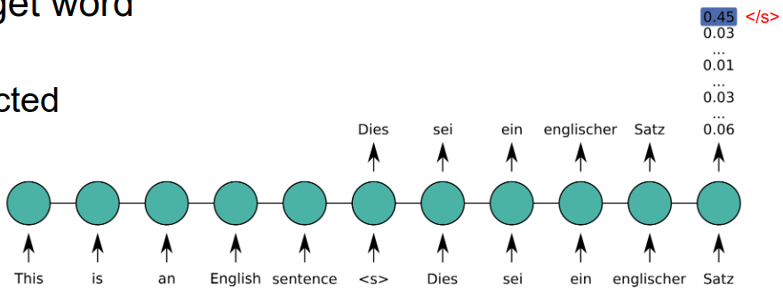
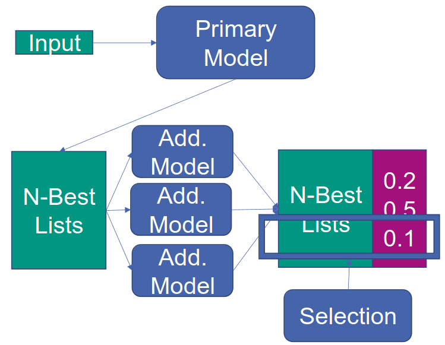
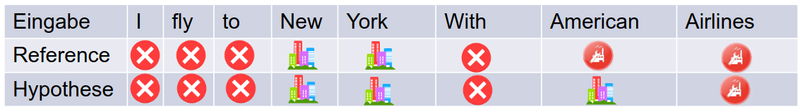

# Decoding
1. Seq-to-Seq model: Generation
    - How do we generate output?
    - Idea
        * Search for possible outputs
        * Model assigns scores to each output
        * Find most probable one
    - Encoder-Decoder: Translation
        * Search for most accurate output: don't always have a reference
        * Search for most probable output
1. Basic search
    - 
    - Idea
        * Input the source sentence
            + Forward pass = calculate hidden states of tokens
        * Input \<s\>
            + Calculate output probabilities
            + Select most probable next word
        * Input selected target
        * Continue
            + Until End token is generated (\</s\>)
    - Problem
        * This is a greedy approach
        * Output influences the input (problem of Autoregressive models)
    - Example Challenge:
        * Joint probabilities could be higher than individual ones
        * Example: P(Dies) > P(Das), but P(Dies ist) < P(Das ist)
    - Exact search
        * Try all combinations
        * Maximum a-posterior decoding
        * Challenge: too many combinations => only possible for short sentences
1. Beam search
    - Idea: keep n best hypotheses
    - Steps
        * Calculate probabilities of all outputs (z.B. translations)
        * Select top n
        * Extend all hypotheses in the beam (predict next word for each of the top n)
        * Recalculate probabilities and prune beam (remove extras)
    - Notes
        * Beams can have different lengths
1. Sampling
    - Idea: Randomly select next words based on conditional probability
    - Problem: way too many choices => all probabilities are low and jointly we have a high chance of getting garbage
    - Top-k Sampling
        * Select top k words and re-normalize the probability
    - Nucleus Sampling
        * Only select words with probability > p
1. Types of errors
    - Model error = the model does not assign the highest probability to the correct translation
    - Search error = the search does not find the translation with the highest probability
1. Combination of models
    - Randomly initialize models
    - Each model has strengths and weaknesses
    - Model Ensembles
        * Combine output layers of different models
        * Properties
            + Good performance
            + Slow training and decoding speed
        * Idea: checkpoint ensemble
            + Save checkpoints during training of a model
            + Start other models from different checkpoints
            + Improves training speed
    - Rescoring/Reranking
        * 
        * Sometimes combining is difficult
            + Different vocabulary
            + Different types (language vs seq-to-seq)
        * Enables combination of different types
        * Idea
            + Create list of n-best solutions with primary model
            + Rescore each using the other models
            + Select the best (sum/weighted sum)

# Model Evaluation
1. On sequence labeling tasks
    - 
    - Ambiguous annotation (limited or depends on task)
    - Different importance of errors (handling longer entities)
1. On sequence-to-sequence tasks
    - 
    - Different output lengths
    - High ambiguity (machine translation, summarization)
1. Evaluation of Machine Translation (MT)
    - Measure quality of translation
    - Difficulties
        * Multiple correct translations
        * Small changes can be important
        * Subjectivity
        * Application-dependent
    - Human vs Automated
        * Human = Gold standard, subjective, expensive, time-consuming
        * Automatic = cheap, fast, uses human reference
    - Granularity
        * Sentence-based = error analysis, difficult
        * Document-based = mostly in automatic evaluation
        * Task-based: final goal, depends on other components
    - Adequacy vs Fluency
        * Adequacy = Is the meaning translated correctly?
        * Fluency = Is the output fluent?
    - Error analysis
        * Identify most prominent error sources
        * Get interpretable results
        * Error classification = missing words, word order, etc.
        * Test suits = examples of different language phenomena
1. Types of Human evaluation
    - Quality measures
        * Intra-annotator agreement = between different annotators
        * Inter-annotator agreement = within an annotator
    - Direct assessment
        * Given: source, translation, reference translation (optional)
        * Evaluate: performance, adequacy, fluency
        * Problem: normalization across judges
    - Ranking
        * Rank different systems based on performance
        * Difficulties: how to compare different types errors
    - Post-editing
        * Correct a translation
        * Measurement effort: time, keystrokes
    - Task-based evaluation
        * Evaluate the complete system
        * Advantage: overall performance
        * Disadvantage: complex
1. Automatic Metrics
    - Features
        * Perplexity = probability of reference translation
        * Problem: evaluate model errors, can't assess search errors
        * Idea: compare system output to reference
    - BiLingual Evaluation Understudy (BLEU)
        * Most commonly used for machine translation
        * Idea: translations similar to the reference are better
        * Count the number of equal sentences
            + Use n-gram overlap
            + Geometric mean of 1-n grams (e.g. sqrt4(1-4 grams))
        * Problem solvers
            + Add brevity penalty for short sentences
            + Clipping: max count of n-grams in any reference
            + Aggregate statistics over whole document
        * Properties
            + Matches exact words (several references possible)
            + Adequacy = using word precision
            + Fluency = using n-gram precisions
            + No recall (have brevity penalty)
            + Aggregate scores over a large test set
    - Evaluating Summarization
        * Idea: compare automatic summaries to reference ones
        * Problem: different sentences => no exact match
        * Recall-Oriented Understudy for Gisting Evaluation (ROUGE)
            + Use approximate matches
            + Many flavors (n-grams, longest common subsequence (LCS), weighted LCS)
