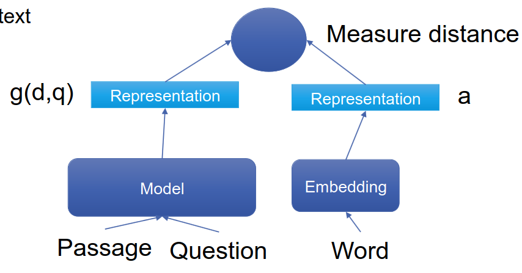
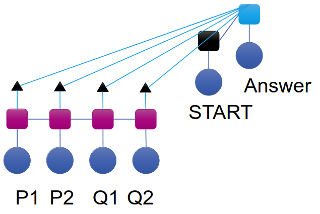
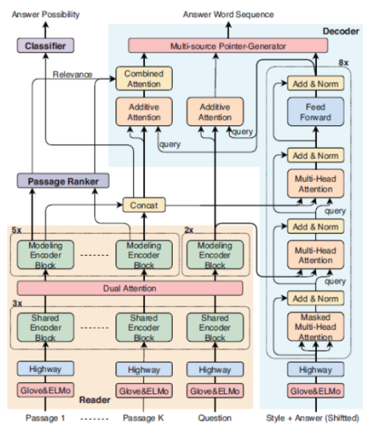
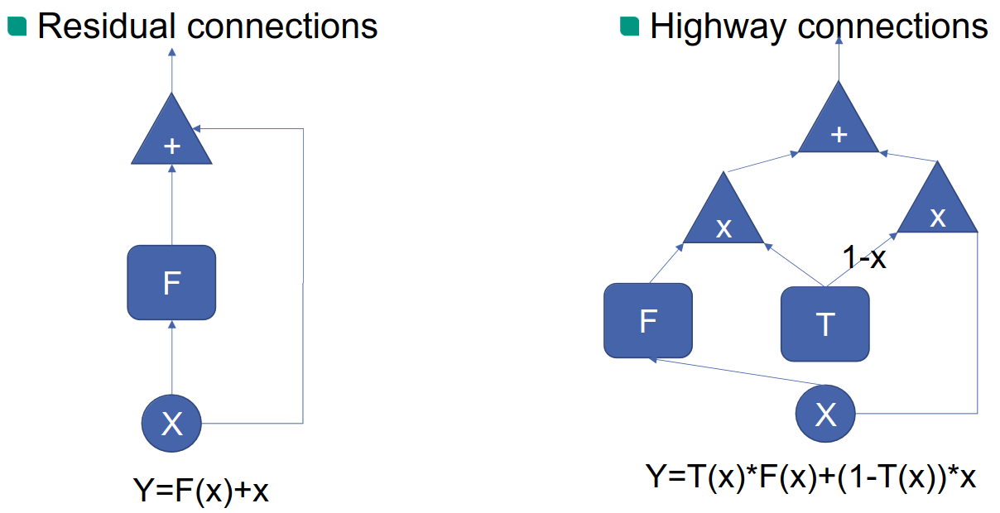
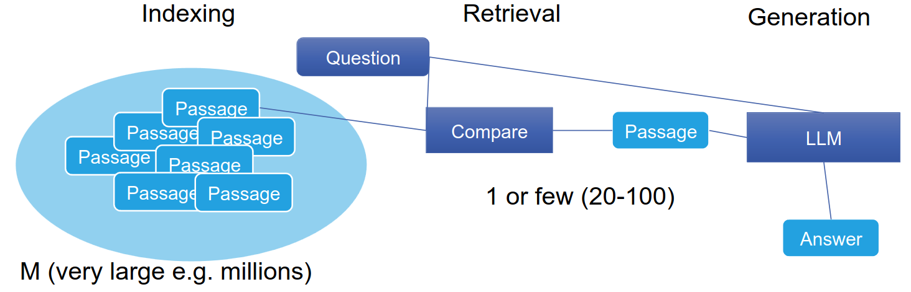

# Question Answering
1. Neural Question Answering
    - Start with a simple version
    - Reading Comprehension (RC)
        * Answer question based on passage of text
        * Advantage: no information retrieval
        * First step: large training data set
    - Challenges
        * Find knowledge
        * Generate Answer
    - Approaches
        * RC + IR
        * Large Language Models (knowledge stored within the model)
        * Retrieval Augmented Generation (RAG)
1. Neural Reader
    - 
    - First neural QA model
    - Idea
        * Learn representation of question and text
        * Compare to word embedding
        * Find best fitting word
    - Versions
        * Deep LSTM
        * Attention
        * Impatient (Like LSTM, but also for each layer)
1. Concepts
    - QA as Span Detection
        * Input = Passage and Question
        * Output = Mark words which are part of the answer
        * Problem: available data
        * Solution: use large pre-trained model
    - QA as Sequence Selection
        * Span Detection + extra parameters (Start and End)
        * Compare each contextual embedding with S and E
    - Unanswerable Questions
        * Problem: Systems invent answers if they don't know

# Generative Reading Comprehension
1. Ideas
    - 
    - Sequence-to-sequence model
    - Input = Question and Passage(s)
    - Output = Answer as free text
    - 2 answer styles: Q&A and NLG
1. Passage reader
    - 
    - Contextual Embedding
        * Use data without annotations
        * Examples: Glove + ELMO, Concatenation, Highway network
    - Architectures
        * 
    - Shared Encoder Block
        * Self-attention
        * Stacked layers
        * Share weights between different parts
            + Each passage should be treated the same
            + Only exchange information within the passage
    - Dual Attention
        * Attend to passage and question
        * Not between passages
        * Co-attention
    - Passage Ranking
        * Input = first hidden state of each passage
        * Output = Prediction/Loss
    - Answer Possibility
        * Can the question be answered?
        * Input = first hidden state of each passage
        * Output = Prediction/Loss
    - Decoder
        * Contextual embeddings (make use of non-annotated data)
        * Artificial start token
            + Baseline: \<s\> = only tell the system to start a sentence
            + Idea: \<Style\> = control style/train jointly model for two styles
        * Multi-Attention blocks
            + Self-attention
            + Passage attention
            + Question attention
        * Copy mechanism
            + Answer will contain words from question and passages
            + Commonly used in summarization
            + Challenge: sub-word units, out-of-vocabulary words
    - Training
        * Combine multiple losses (ranker, classifier, generator)
        * Select weights for each
1. Large Language Models (LLMs)
    - For reading comprehension
        * Input = Context + Question
    - General QA
        * Extra Challenge: How to retrieval relevant information
    - As knowledge base
        * Input = question

# Retrieval-Augmented Generation (RAG)
1. Idea
    - 
1. Motivation
    - Integrate knowledge from other sources
    - Dynamically retrieve relevant information
1. Indexing
    - Traditionally: Inverted Index
        * Input = Term
        * Output = list of documents which contain it
    - Deep Learning based
        * Database of embeddings
        * Fast retrieval (nearest neighbor)
    - Challenge: Granularity (single sentence vs block)
1. Retrieval
    - Use IR to find relevant passages
    - Traditionally: TF-IDF (compare vectors of question and passage)
    - Deep Learning based: compare embeddings
1. Dense Passage Retriever (DPR)
    - Challenges
        * Compare question to many passages fast
        * Training of embeddings (how to generate negative samples)
    - Comparison
        * Passage encoder
        * Question encoder
        * Compare using Euclidian distance
            + Enables fast algorithms for finding nearest neighbors
    - Encoder
        * BERT representation
        * CLS token
    - Inference
        * Offline
            + Pre-calculated passage embeddings
            + Index using FAISS (library for similarity search and clustering)
        * Online
            + Calculate question embedding
            + Retrieve top k passages
    - Training
        * Motivation
            + Relevant pairs should be next to each other
            + Irrelevant - far away
            + Metric learning ()
        * Positive examples = training
        * Negative examples
            + Randomized
            + Gold = relevant for other examples
1. Pre-retrieval
    - Goal: find better matching content
    - Techniques
        * Query Routing
            + Several data stores
            + Alternate/merge different results
        * Query Rewriting/Expansion
            + Aligning the semantics of a query and a document
            + Use LLM to generate document
1. Post-retrieval
    - Motivation
        * Merge with query
        * Addressing challenges of context window limits
    - Techniques
        * Re-Ranking of retrieved info to relocate the most relevant content
        * Prompt Compression
            + Compress irrelevant context
            + Highlight pivotal paragraphs
            + Reduce overall context length

