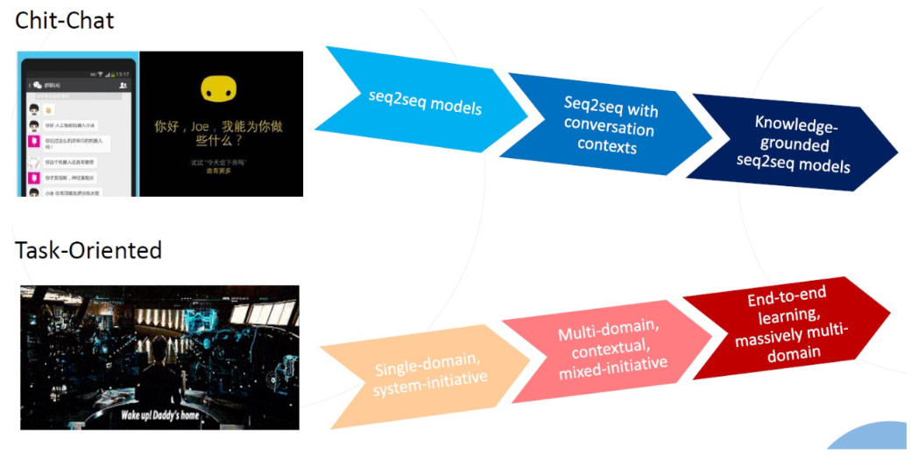
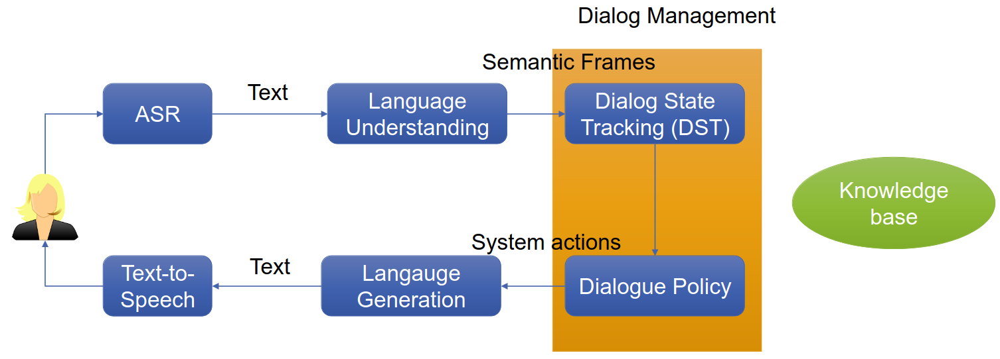
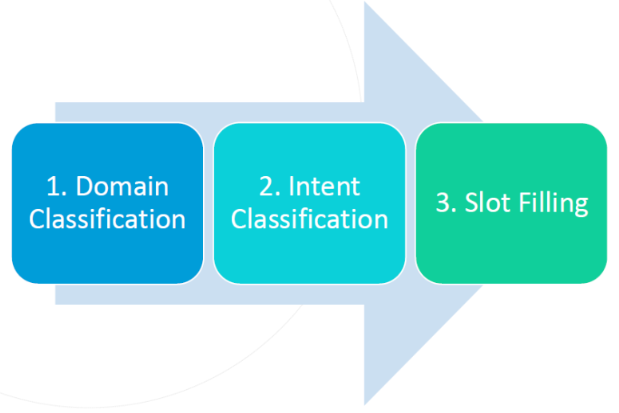
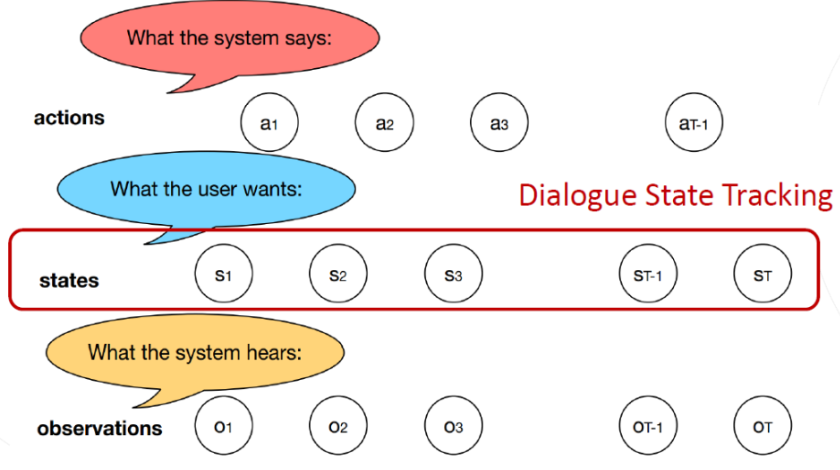
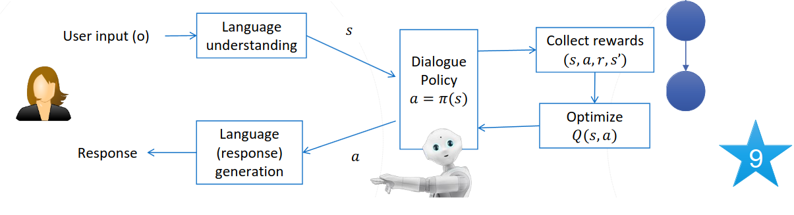

# Dialog Systems/Conversational Agents
1. Types
    - 
    - ChitChat = Chatbots
    - Task-oriented (TOD) = SIRI, car interfaces, robots, booking systems (flights, restaurants)
1. BABI task: Restaurant reservation
    - Subtasks
        * Issue API calls to Knowledge Base (KB)
        * Update API calls
        * Display options
        * Provide extra info
    - Artificial data
        * Simulate based on underlying KB
            + e.g. 10 types of cuisines, 10 locations, 3 price ranges, 8 ratings
        * Generate using 43 patterns for user and 20 for bot
    - Simulate dialogs
    - Split KB to have out-of-domain words
    - Simplification: no generation, only ranking
1. Wizard of Oz (WOZ) data collection
    - Users think they're talking to a computer, but it's actually a human
    - Wizards = humans pretending to be computers
    - Need lots of data
    - Flow: User1 -> Wizard1 -> User2 -> Wizard2
    - Results in domain-specific training data
    - Multi-domain WOZ (MultiWOZ)
        * Example: tourist and a clerk
        * Same collection method
        * Seven domains: Hotel, Train, Attraction, Restaurant, Taxi, Hospital, Police
1. Pipeline Approach
    - 
1. Goal Oriented Dialogs
    - Natural Language Understanding (NLU)
        * 
    - Dialog State Tracking
        * 
        * Deduce information about user's goal
            + Track over time, use external knowledge
        * Challenge: Input (ASR/NLU) might have errors
        * Input
            + All observations until time t (Transcription NLU, external knowledge)
            + Set of possible dialog state hypotheses
        * Output = Probability distribution of hypotheses
        * Challenges
            + Robustness: keep distribution of several states
            + Known slot values: pointer networks
    - Dialog Policy
        * Given current dialog state: what is the best answer?
        * Examples
            + Give information
            + Ask for more info
            + Ask for clarification
    - Language Generation
        * Generate answer based on info
        * Traditionally: template-based methods
        * State of the art: Language models, structure data -> natural language
1. Reinforcement Learning
    - 
    - Supervised = learning from teacher
    - Reinforcement = learning from critics
    - Idea
        * Run full dialog
        * Calculate reward at the end
        * Attribute reward to previous actions

# Neural Dialog Manger
1. Deep Q-network
    - Input = current semantic frame observation + data based results
    - Output = system actions
    - Joined Dialog State Tracking and Policy learning
    - Initialization: supervised learning based on rule-based agent
    - RL with user simulation
1. User simulation
    - Generate user goal
        * Inform\_slots = constraints for the dialog system
        * Request\_slots
        * Generated from data
    - User Agent Modeling
        * Goal (Constraint and Request)
        * Agenda A
1. TOOD: continue
