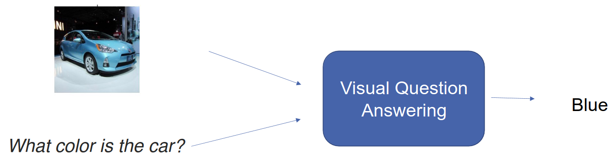
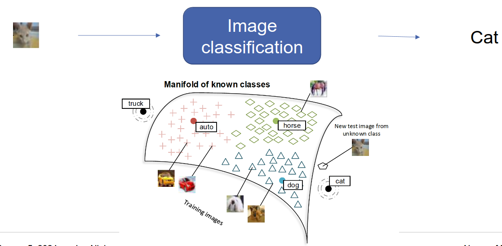
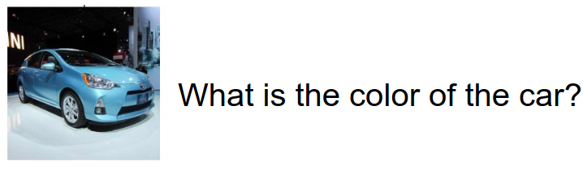
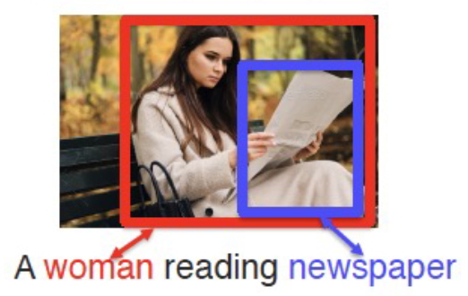
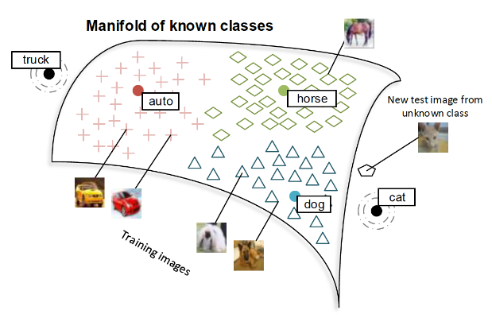
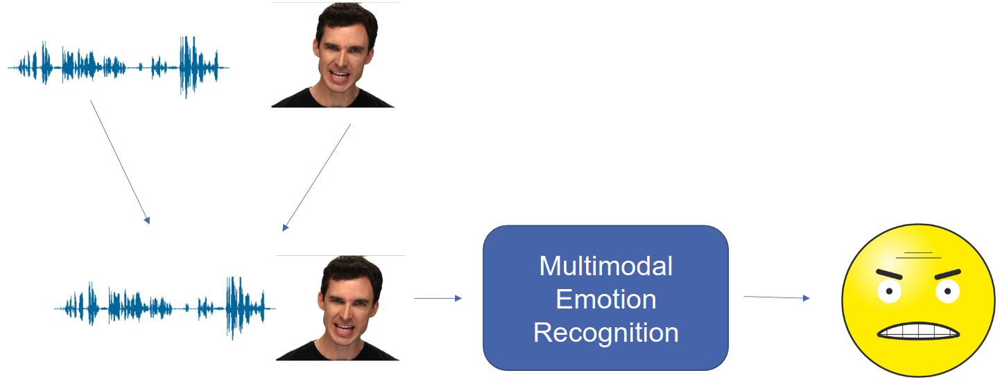
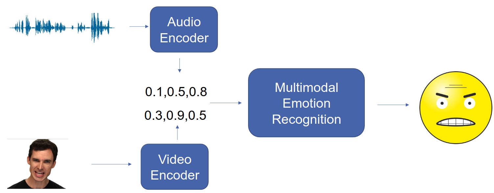
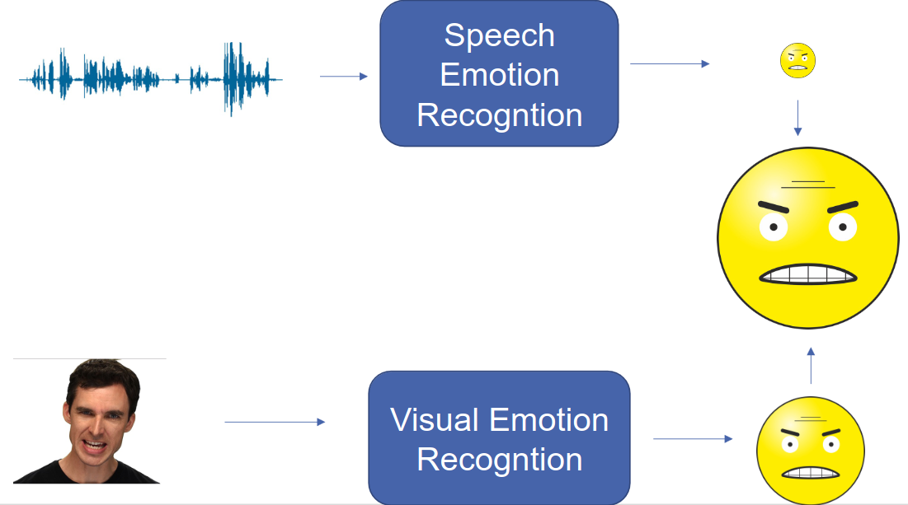
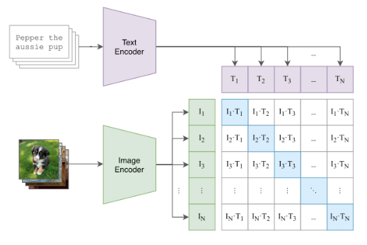
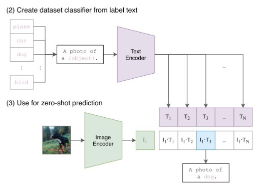

# Multimodal Processing
1. Advantages
    - Redundant Information
        * 
        * Example: Multimodal Emotion Recognition
        * Challenge: Information fusion
    - Complementary Information
        * 
        * Example: Visual Question Answering
    - Knowledge Transfer
        * 
        * Example: Zero-shot Image Classification
    - Multimodal Tasks
        * Example: Visual Question Answering
        * Input = image + NL open-ended question
        * Output = NL Answer
        * Datasets = Visual Turing Test (city images), Daquar (uni images), ...
        * Challenges
            + Image/Language representation
            + Combining modalities
            + Question-specific reasoning
            + External knowledge

# Modality
1. Definition: The way in which something is expressed or perceived (speech, image, language, sentiment, objects)
1. Heterogeneous Modalities
    - Structure = static, temporal, spatial
    - Representation space = discrete, continuous, interpretable
    - Information = entropy, density, information overlap
    - Granularity
    - Noise
    - Relevance
    - Raw = close to the senses
    - Abstract = language, ...
1. Basic idea: fuse modalities
1. Core Technical Challenges
    - Representation
        * 
        * Learn one that reflects cross-modal interactions
        * Example: combine audio and visual or text and image
    - Alignment
        * 
        * Identify connections between modalities
        * Example: map words from a caption to parts of an image
    - Transference
        * 
        * Transfer knowledge between modalities
1. Fusion
    - Raw modalities
        * 
        * Directly fuse the input
        * Challenges
            + Likely more heterogeny
            + Alignment might be needed
        * Approach: Concatenate features (vectors?)
    - Abstract modalities
        * 
        * Idea: fuse the intermediate representations
        * Advantages
            + Uses unimodal knowledge
            + Increases the similarity of the representations
        * Approaches: Additive, Multiplicative, Gated interactions
    - Late fusion
        * 
        * Merge predictions
        * Challenges
            + Unimodal predictions are possible
            + Does not model the interaction
1. Coordination
    - Multimodally-contextualized representations which are coordinated through their cross-modal interactions
    - Strong coordination
        * Increase similarity of same information from different modalities
        * Example: Word "dog" and image of a dog
        * Applications: multimodal QA, zero-shot image classification
        * Input = pairs from different modalities
        * Idea
            + Have separate encoders for each modality
            + Learn a representation that is similar
        *  Coordination function
            + Finds a representation for both modalities
            + Cosine similarity
            + Learning: minimize the coordination function
            + Contrastive learning: similar pairs - together, dissimilar - apart
1. Dedicated models
    - Multimodal Pre-training
        * 
        * Goal: achieve high similarity between text and image representations
        * Example: Contrastive Language-Image Pre-training (CLIP)
            + Image encoder = CNN/ViT
            + Text encoder = transformer
        * Contrastive loss
            + Max similarity between Ii \* Ti
            + Min similarity between Ii \* Tj
    - Zero-shot classification
        * 
        * Find most probable caption (Prompt: A photo of a {label})
        * Technique
            + Calculate image and text embeddings
            + Select most similar
    - Shortcomings
        * Only uses a similarity score
        * Typically only classification (no generation)
